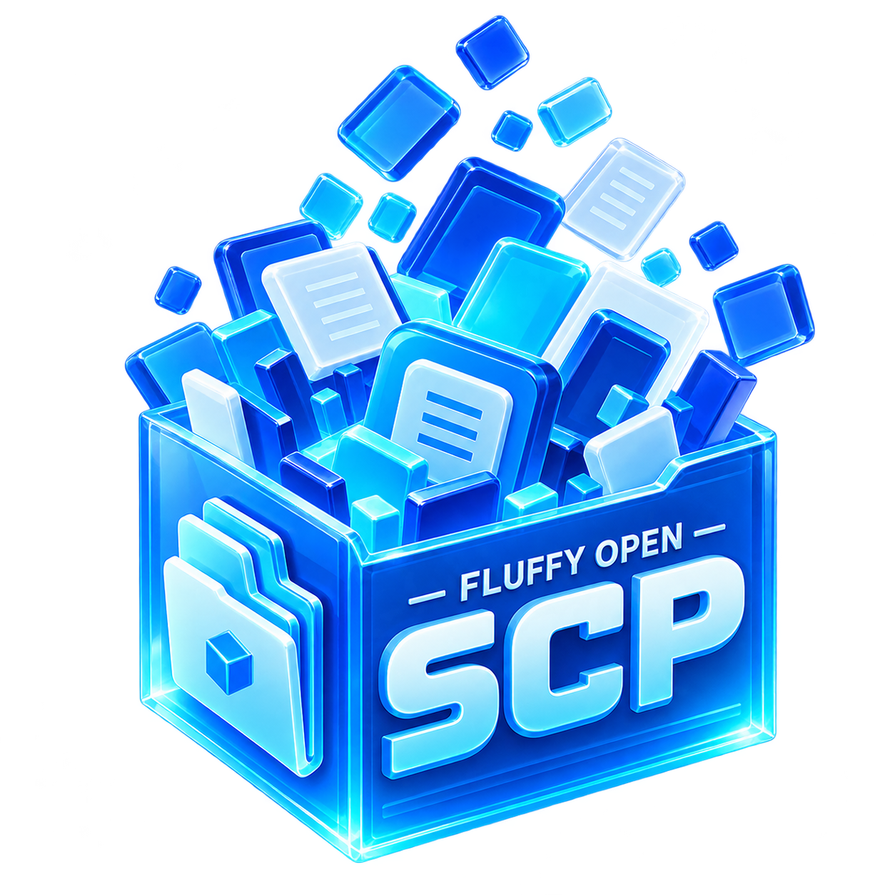

<p align="center">
  
</p>

# OpenSCP

> A modern Rust + Tauri explorer for SimCity (2013) `.package` files — browse resources, export models (glTF/OBJ), textures, properties, audio and video.
>
> 基于 Rust + Tauri 的 SimCity (2013) `.package` 资源浏览器 —— 查看资源结构，导出模型（glTF/OBJ）、贴图、属性表、音频与视频。

## 简介 / About

**English**

OpenSCP is a modern desktop tool for browsing and extracting **SimCity (2013)** game resources. It is a Rust + Tauri 2 + Vue 3 rewrite of the classic C#/WPF SimCityPak, redesigned around the pain points of the original: a clean, responsive UI (shadcn-vue + Tailwind CSS), syntax-highlighted viewing of embedded text resources (JSON/HTML/JS/C++ via Shiki), safe handling of huge resources (virtualized, paged views instead of loading everything into memory), and a clear tree view of each package's internal structure. Native Rust parsers for the DBPF container and RenderWare4 assets export models to glTF/OBJ (with materials, skeletons and animations), textures to PNG/DDS, property lists to readable JSON/TXT, and decode Wwise audio and VP6 video into standard formats.

**中文**

OpenSCP 是一款现代化的桌面工具，用于浏览与提取 **SimCity (2013)** 的游戏资源。它是对经典 C#/WPF 工具 SimCityPak 的 Rust + Tauri 2 + Vue 3 重写版，针对原工具的痛点重新设计：清爽流畅的界面（shadcn-vue + Tailwind CSS）、内嵌文本资源的语法高亮查看（基于 Shiki，支持 JSON/HTML/JS/C++ 等）、大资源的安全浏览（虚拟化分页渲染，不再整块载入内存导致卡死），以及清晰的包内资源树视图。底层由纯 Rust 实现的 DBPF 容器与 RenderWare4 资源解析驱动，可将模型导出为 glTF/OBJ（含材质、骨骼与动画）、贴图导出为 PNG/DDS、属性表导出为可读的 JSON/TXT，并能把 Wwise 音频与 VP6 视频转码为通用格式。

## 功能特性 / Features

- **现代应用壳**：基于 [fluffy-design-pro](https://github.com/FluffyChi-Xing/fluffy-design-pro)（shadcn-vue + Tailwind CSS 4），内置暗色模式、命令面板、多页签与多语言
- **包结构树视图**：DBPF 索引按 TGI（Type / Group / Instance）组织浏览，直观呈现 `.package` 内部结构
- **语法高亮查看**：内嵌文本资源以 Shiki 渲染，覆盖 JSON / HTML / JS / C++ 等语言
- **大文件安全**：分页 + 虚拟化渲染，避免原版「打开大资源 → 内存溢出 → 卡死」的问题
- **资源导出**：模型 → glTF 2.0（`.glb`，含材质 / 骨骼 / 动画）/ Wavefront `.obj`；贴图 → PNG / JPG / TGA / DDS；属性表 → JSON / TXT
- **音视频支持**：Wwise Vorbis 音频 → WAV（vgmstream）、VP6 视频 → MP4（ffmpeg）

## 项目结构 / Project Layout

```
fluffy-open-scp/
├── src/                    # Vue 3 前端（fluffy-design-pro 应用壳）
├── src-tauri/              # Tauri 2 应用壳（command 绑定层）
├── crates/
│   ├── dbpf/               # DBPF (.package) 容器格式 + RefPack 解压
│   ├── rw4/                # RenderWare4 模型 / 贴图 / 骨骼 / 动画解析
│   ├── sc-properties/      # 属性列表资源 (0x00b1b104) 解析
│   └── sc-exporter/        # OBJ / glTF / 贴图 / 属性表导出器
└── docs/
```

解析库（`crates/`）不依赖 Tauri，可独立测试与复用；`src-tauri` 仅负责将它们以 command 形式暴露给前端。

## 开发 / Development

环境要求：Rust（stable，edition 2024）、Node.js ≥ 20、pnpm ≥ 11，以及 Tauri 2 在 Windows 下的常规依赖（WebView2、MSVC Build Tools）。

```bash
pnpm install          # 安装前端依赖
pnpm tauri dev        # 桌面应用开发模式
pnpm tauri build      # 构建发布版
pnpm test             # 前端测试（vitest）
cargo test            # Rust 测试（workspace）
```

## Roadmap

当前路线分为两层：

- **P0 底座**：DBPF/RefPack、RW4、属性表的可靠解析与写回，OBJ 导入、overlay package、精细错误和 roundtrip 测试
- **P1 Modding Suite**：`openscp.mod.toml` 声明式项目、一键构建、LOD/依赖管理、自动校验、可行动诊断、预览与文件监听
- **P2/P3**：高级材质/LOD/骨骼编辑，以及游戏联动、依赖生态和插件能力

详细规划：[`docs/roadmap/modding-suite.md`](docs/roadmap/modding-suite.md)；底层迁移进度：[`docs/roadmap/migration.md`](docs/roadmap/migration.md)。

## 致谢 / Credits

- [altinctrl/SimCityPak](https://github.com/altinctrl/SimCityPak) —— 本项目迁移来源（原 CodePlex 项目，原始权利归原作者所有）
- [vgmstream](https://github.com/vgmstream/vgmstream) / [ffmpeg](https://ffmpeg.org) —— 音视频解码
- [fluffy-design-pro](https://github.com/FluffyChi-Xing/fluffy-design-pro) —— UI 应用壳与组件生态

## License

MIT。SimCity 与 SimCityPak 相关的原始权利归其各自作者所有。
