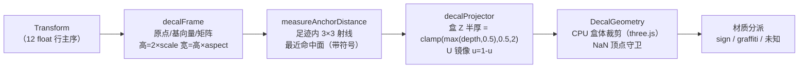

# SimCity 贴花（Decal）渲染管线

> 本文是 OpenSCP 逆向系列的第三篇，面向 clone / star / fork 本仓库的读者。
> 内容：贴花（招牌、涂鸦、破洞、废墟墙块等贴在建筑/地面上的装饰）从数据包
> 到屏幕的完整链路——数据结构、投影几何、纹理与通道语义、引擎侧机制、以及
> 本仓库的前端复刻实现。全部结论来自反编译、真实包探针与原版游戏对拍，
> 只陈述已定案的事实。
> 系列另两篇：[SimCity 游戏整体架构](./simcity-game-architecture.md)、
> [GlassBox 引擎整体架构](./glassbox-engine-architecture.md)。

实现位置：`crates/sc-properties/src/decal.rs`（字典解析）、
`crates/rw4/src/raster.rs`（纹理解码）、
`src-tauri/src/package_service.rs`（跨包解析）、
`src/lib/decalProject.ts`（投影几何）、
`src/pages/packages/components/property-editor/PropertyEditorViewport.vue`
（渲染）。验证探针在 `crates/sc-exporter/examples/decal_*.rs`。

---

## 1. Decal 数据链

### 1.1 贴花字典（Decal Atlas）是普通 Property

"decal atlas" 不是图片，是普通 Property 资源（typeId `0x00B1B104`），按
Group 低 16 位分三册：`0xB185` / `0x1651` / `0x1652`。SimCity_Game.package
含 7 个字典，条目数 29 / 149 / 190 / 247 / 254 / 385 / 440。

载荷是**列式并行数组**（无条目计数字段，条目 i = 各数组下标 i 的元组）：

| 哈希 | 层级 | 含义 |
|---|---|---|
| `0x0CE5EF4E` | 字典级 | MaterialId（材质引用） |
| `0x0CE5EF4F` | 字典级 | TextureSize |
| `0x0CE5EF60` | 字典级 | AtlasSize |
| `0x0CE5EF50` | 条目级 | ID |
| `0x0CE5EF53` | 条目级 | AspectRatio |
| `0x0CE5EF58` | 条目级 | RasterFileID（→ 纹理资源） |
| `0x0CE5EF5C..5F` | 条目级 | Color1..4 |

### 1.2 lot 上的贴花单元

lot property 内的 decal 单元是一族按类别偏移的哈希（category 0..2 各一套，
`base+cat`），与脱壳 exe 的属性注册函数 `FUN_0081D680` 逐项一致：

| 哈希 | 类型 | 语义 |
|---|---|---|
| `0x0D109050` | Key | 贴花 ID（→ 字典条目） |
| `0x0D109060` | Transform (56B) | 贴花变换 |
| `0x0D109070` | Float | Depth |
| `0x0D109080` | Vector3 | MaterialData |
| `0x0D109090` | Key | RenderGroup |
| `0x0D1090A0` | Int32 | MachineSpec |

对 1423 个含 decal 的 lot 全量普查：ID / Transform / Depth / MaterialData
全部存在；Depth 实测 0.100–18.980 m、均值 1.559 m——语义是「变换原点沿局部 Z
到贴花平面的授权距离」。`materialData`（`0x0DA76A05/06`）是标量 Float：实测
0.5 / 2.0 代入引擎公式恰为破洞假内景的光强度（`lightScale = x·16+1`）与半径
（`invRadius = y·4`）。

### 1.3 纹理资源与跨包解析

- 条目纹理有**双载体**：多数指向裸 Raster（`0x2F4E681C`），破洞/废墟字典的
  纹理是 RW4 内嵌纹理（`0x2F4E681B`）——解析器统一处理两种。
- raster 主要分布在 Graphics / EP1 / DLC0 包：只开 Game+Graphics 命中率仅
  6–68%，四包联合查找后 99%+。
- 源纹理分辨率 32–128 px（多数 64×32 / 128×64）。投影到数米宽的墙面后为
  6–18 px/m 的固有像素密度——原版游戏同样是像素化的。

### 1.4 材质三聚类

字典 MaterialId 是运行时效果系统的裸引用（三个 instance，全类型搜索静态零
命中——材质→shader 变体的映射不在静态数据里）。探针 + 全量约 723 张纹理转储
目检定谳三个聚类：

| instance | 聚类 | 数量 | 特征 |
|---|---|---|---|
| `0x73684EFC` | 商业招牌 | 444+ | POWER ELECTRIC / CASINO 等 |
| `0xE5390A98` | 涂鸦/贴纸 | 441+ | |
| `0x4491DE3A` / `0x44A3F5BA` | 废墟/破坏墙块 | 29 | 128×128 raw，全部无 Color1-4，含 2 张水面 decal |

## 2. 投影几何

### 2.1 变换与投影方向

- Transform 的 12 个 float = **WPF Matrix3D 行主序（行向量约定）**：前 3 行 =
  正交单位基向量（实测 |v|=1.000），末行 = 平移。
- 投影方向 = **+局部 Z**：在 casino lot 的 7 个 decal 足迹内做 3×3 射线，
  9/9 全部命中 +Z 且命中距离高度一致。
- 引擎机制（shader 实证）：VS `texcoord0 = mul(modelToTexture, modelPos)`，
  PS `clip(1 - abs(texturePosition))` ——贴花是一个**投影盒的体积裁剪**，UV =
  盒内归一化坐标（`uvOrig = xy·-0.5 + 0.5`）；PS 无背面/法线判定、不跑光照。

### 2.2 盒尺寸：scale 是半高（OMEGACO 对拍定谳）

招牌板几何实测 19.95×9.56 m，scale=4.9、aspect=2 → 引擎 quad = **高
2×scale**（9.8 ≈ 9.56 ✓）、**宽 = 高×aspect**（19.6 ≈ 19.95 ✓）。旧的
「宽=2×scale、高=宽/aspect」口径使 aspect>1 的招牌整体小一半（游戏字占板 92%
vs 错误版 49%）；aspect=1 时两口径同值——这正是"楼顶 logo 正常、墙面招牌小
一半"的成因。

### 2.3 锚定与盒厚

- Depth 与实际命中距离**无相关性**（同一 depth=2.140 对应命中 4.60 / 8.47 m）
  → depth 不是盒 Z 半厚。盒 Z 半厚 = `clamp(max(depth, 0.5), 0.5, 2)`，Z 由
  运行时射线实测。
- 锚定 = 足迹内 **3×3 射线取「最近命中面」且带符号**（命中距离 × 符号）。旧的
  「中位数」口径在窗格/多层墙会落在层间半空（玻璃塔破洞悬浮的根因）。
- UV **只镜像 U**（`u = 1-u`）：引擎 PS 的 `uvOrig = xy·-0.5 + 0.5`（U 取负）
  + VS 取负 x；V 方向由 D3D v=0 在顶 + `flipY=true` 抵消。
- 垂直投影轴特判：`|axisZ.z| > 0.7` 的 decal（道路裂缝/垃圾/油渍）不平铺投影，
  改平铺在地面（z=0.035，yaw 取 transform 首行方向）。
- fallback quad 沿局部 **-Z** 让开 depth（引擎 `decalMaterialInfoWithObjectData`
  的 VS 同样取 -z）。

## 3. 通道语义：四色是编辑器预览，raw RGBA 是渲染真相

- decal raster 的四通道是**数据不是颜色**。`decode_lot_mask_rgba` 的四层量化
  （每像素 RGBA 各对应一层，≥128 选中该层颜色）复刻的是原版编辑器
  `ViewLotEditor.RasterChannel.Preview` 的**预览口径**：优先级
  `CHANNEL_TO_COLOR` = **A > R > G > B**。
- 注意这套优先级与 lot 地表 shader 的 `w→z→y→x`（**A > B > G > R**）**不是
  同一套**——两者是不同消费者，不能混用。
- 引擎 decal PS 的真实行为是**直采 raster + 标准 alpha 混合**
  （`Current.color = tex2D(s0, uv)`），无任何四色量化。四色 argmax 在背景
  128 阈值附近逐像素抖动（OMEGACO「点阵」伪影），alpha 二值化会抹掉光晕——
  因此本项目 **raw RGBA 优先、四色量化仅作回退**。
- raw alpha 的实测语义是**抗锯齿掩码**（字母核 ≥0.5、边缘渐变到 0）：连续
  透明混合会把整个光晕显示出来（半透明糊团）；0.5 等值线 cutout 与游戏观感
  一致；招牌类配 ×2 增亮（引擎 `Current.color.rgb *= 2` 同数，再经 hejl
  tonemap 得到霓虹感）。
- Color1..4 不是调色板，而是**参数表 4 行 float4**：行 3 = 动画参数（符号选
  UV 轴 / 整数=分块数 / 小数=偏移，与 `decalLightBackground` PS 逐字段吻合）、
  行 0 = 光照参数（`kSunContributionAmount = row0.x`）；经 VS `customParams[4]`
  按实例下发。
- 全息广告族（`decalFloatQuad`）不用投影：UV 来自逐顶点 indices 字节
  （`texcoord0.xyz = indices.yzw/255`），位置来自记录烘焙顶点缓冲 + 逐实例
  变换——悬空/超尺寸是烘焙几何的固有属性。

## 4. 引擎侧批绘机制

`FUN_007EBE70`（字符串 `DecalDrawBatch`）批绘真实网格：每条 decal 记录
0xD4C = 3404 字节、**自带顶点缓冲**（位置/UV 在记录内），不是运行时现算 quad。
「宽/高由 scale 算出」只是前端几何近似的口径。

## 5. 前端复刻实现

### 5.1 管线

`decalFrame`（盒参数）→ `measureAnchorDistance`（3×3 射线锚定）→
`decalProjector`（构造投影盒）→ three.js `DecalGeometry` CPU 盒体裁剪 →
按材质变体建 mesh。结果按 (unit, transform, depth, aspect) 缓存，AABB 粗筛，
投影用 **matrixWorld 恒等的代理 Mesh**（真实 mesh 会把结果抛进 renderer 世界
空间）。

### 5.2 材质变体分派

| 聚类 | 材质 | 混合 | 依据 |
|---|---|---|---|
| 招牌 `0x73684EFC` | MeshBasic ×2 增亮 | transparent 连续混合 + `depthWrite:false` | 霓虹自发光（引擎 `rgb *= 2` + tonemap 同数） |
| 涂鸦 `0xE5390A98` | MeshStandard（受光） | `alphaTest: 0.5` cutout + `transparent:false` + `depthWrite:true` | 真机两轮翻车后定谳：连续 alpha → 光晕糊团；自发光 → 夜间蓝光 bug |
| 未知/废墟 | 同 cutout + 受光 | 同上 | 兜底口径 |

公共状态：全部 `side: DoubleSide`（引擎 PS 无背面判定）+ `polygonOffset(-4,-4)`
（贴花与墙面共面，压 z-fighting）。清晰度口径：`generateMipmaps=false` +
`minFilter=LinearFilter` + 最大各向异性（对齐建筑贴图，默认三线性在中远景
明显偏糊）。

### 5.3 兜底与健壮性

- 纹理 DTO 的 png 是裸 base64 字符串，必须拼 data URL 再解码；解码失败
  `console.warn` + 回退（一次"全部贴花退绿色 gizmo"回归的根因）。
- DecalGeometry 在退化/共面三角形下可能产生 NaN 顶点（巨大撕裂三角形）——
  boundingBox 含非有限值即丢弃该投影。
- 投影落空时回退浮空 quad（PlaneGeometry，高 2×scale、宽=高×aspect、
  U 镜像、`translateZ(-depth)`），带 projected/fallback 计数遥测。
- 白模/低模模式显示绿色占位 gizmo（正面近透明白 + 背面绿，同原版
  `RectangleVisual3D`）。
- 破洞假内景光：hole 变体 + lot 带光参数时挂 SpotLight（贴花贴图作光 cookie、
  暖色、`intensity = (scale·16+1)×3`、`distance = radius·8`，上限 8 盏）——
  参数即 §1.2 的 materialData 引擎公式。

## 6. 对拍验证时间线

| 轮次 | 结论 |
|---|---|
| 四色映射 + sRGB | 导出与原版相册**逐张一致**（含 Color 值按「线性值的一半」存储的还原：`linear_to_srgb(X*2)`） |
| 黑底/镜像修复 | 四通道全 <128 的像素输出 alpha=0（黑块消失，`alphaTest: 1/255`）；「Michael's CASINO」水平镜像 = U 轴翻转 |
| 贴花投影上线 | 盒体积裁剪 + 3×3 射线锚定（探针钉死"不能用静态盒"：顶点太稀疏） |
| OMEGACO 对照 | scale=半高定谳（几何实测 19.95×9.56 m vs 推导 19.6×9.8）；raw RGBA 优先消点阵；修复后逐 decal 像素密度与游戏同口径 |
| 涂鸦两轮迭代 | 连续 alpha → 光晕糊团、乘法混合 → 涂鸦消失，最终 cutout（alphaTest 0.5）+ 受光定谳 |
| 破洞悬空三连修 | 授权深度直放 → raycast 双向 signed anchor + 盒体向内延伸 → 最近命中面（现行口径） |

---

*系列导航：[SimCity 游戏整体架构](./simcity-game-architecture.md) ·
[GlassBox 引擎整体架构](./glassbox-engine-architecture.md)*
