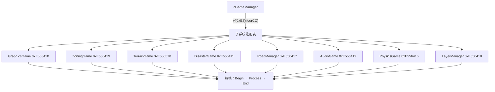
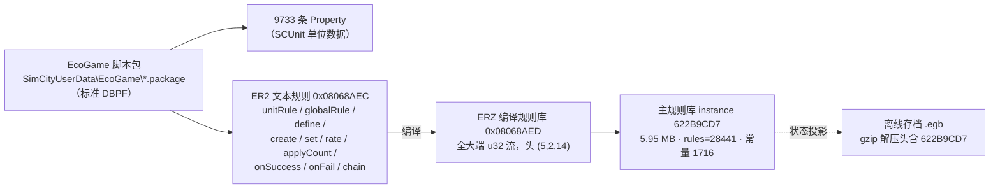
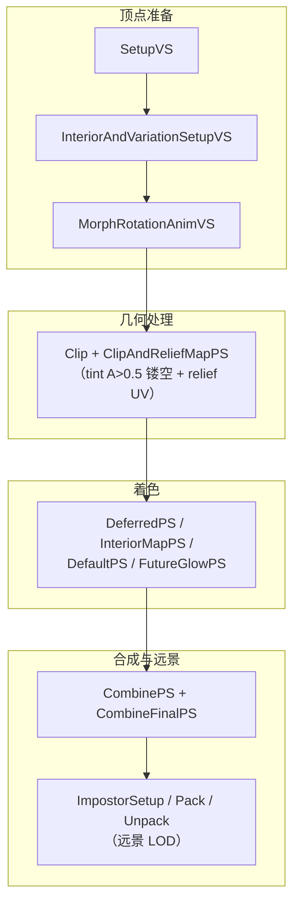

# GlassBox 引擎整体架构

> 本文是 OpenSCP 逆向系列的第二篇，面向 clone / star / fork 本仓库的读者。
> 内容：GlassBox 引擎的模块分层、运行时结构、数据驱动的行为系统、五大模拟
> 子系统、以及渲染层的已确认机制。全部结论来自对脱壳镜像
> （`SimCity_dump_SCY.exe`）的反编译（`docs/source-code/`，348 个伪 C 文件 /
> 346 类 / 5110 虚函数）、真实包探针与运行时动态观察，只陈述已定案的事实。
> 系列另两篇：[SimCity 游戏整体架构](./simcity-game-architecture.md)、
> [贴花（Decal）渲染管线](./decal-rendering-pipeline.md)。

---

## 1. 引擎形态与命名空间分层

- SimCity.exe 是 32 位单体可执行文件，加壳发行，无独立引擎 DLL。
- 引擎即 **`GB` 命名空间**——"GlassBox" 这个字面名称在 exe 中并不存在。
  脱壳后 RTTI 扫描共得 **1027 个类**，按命名空间分层：

| 层 | 类数 | 职责 |
|---|---|---|
| `GB` | 85 | 引擎运行时：游戏管理、Eco 场引擎、状态机、delta 同步、IO 流栈、自更新 |
| `SC` | 325 | 游戏模拟：Agent / 交通管流 / Zoning / Lot / Terrain / Disaster + 27 个 `cShaderData*` 渲染常量结构 |
| `SP` | 37 | 平台 / 渲染支撑（含 `SP::cMIDataT<T>` shader 常量缓冲宿主） |
| Swarm@EA | 13 | 粒子 / 群集中间件 |
| 第三方 | — | Wwise（音频）、Bullet（物理）、ArgScript（脚本/资源描述语言）、Coherent UI / EAWebKit（UI） |

## 2. 运行时结构：子系统注册表与三阶段更新

- 子系统通过 `GameManager->vf[0xE8](fourCC)` 服务定位。反编译实证的注册值：

| fourCC | 子系统 |
|---|---|
| `0xE556410` | GraphicsGame |
| `0xE556411` | DisasterGame |
| `0xE556412` | AudioGame |
| `0xE556416` | PhysicsGame |
| `0xE556417` | RoadManager |
| `0xE556418` | LayerManager |
| `0xE556419` | ZoningGame |
| `0xE556570` | TerrainGame |
| `0xE556413` | BeatRuleHandler |
| `0xE55640F` | GraphicsZone |

- GameManager 持有 0x140 字节定长记录数组；每帧流程 = 相机插值 → 可见性触发器
  → 逐 record tick → Update 分 **Begin / Process / End** 三阶段。
- 全部子系统使用 **COM 式双 vtable + 侵入式引用计数**布局
  （`{vftable@0, vftable@4, refcnt@8}`），代码中同构 7 处实证。

## 3. 客户端 / 服务器分层

代码前缀即分层：**E（Eco，服务器侧模拟）/ G（Graphics，客户端渲染）**。
两侧以引用计数**共享**同一数据对象（如 terrain 的 13 张 typed map），配静态
描述符连接——CPU 侧 map 由 FX 包装对象共享持有，不是逐帧深拷贝
（`FUN_006883C0` 实证）。

## 4. 数据驱动：property → 行为

- 每个子系统的构造/更新函数都以 `vtable+0x28(hash, &out)` 读属性、校验类型
  tag、带默认值回退。
- 横切常量全部是 32 位属性/消息哈希（fourCC）。**FNV/CRC32 均不匹配**（已程序
  化验证），是 Maxis 私有哈希；而 s3db Instances 表 72% 的 ID 可用 FNV-1 计算
  （见系列第一篇 §4）。
- UI 层：`cGameDataPlugin` 等六个 "Plugin" 是 Coherent UI 内嵌 HTTP 服务器上的
  URL 处理器（`/gamedata`、`/gamedata_batch`、`/gameevents`、`/resource` 等），
  统一 JSON 响应——插件体系本质是内嵌 HTTP 路由。

## 5. 五大模拟子系统

### 5.1 Eco / Swarm：经济模拟

经济 =「**beat 规则表 → int 网格场（SwarmMap）→ property 协议触发效果 → 受体
回调**」，经济侧没有独立的 agent 类。

- SwarmMap 数据结构（11 个函数已还原）：`{AABB[6]×f32, width, height,
  int32 网格 ×scale}`；`cEcoSwarmMap` 最近邻采样、`cEcoSwarmLerpMap` 双线性插值。
- beat 规则引擎：规则表在数据 blob `+0x50/+0x54`（相位 B `+0x60/+0x64`），每
  规则 12 字节 ushort 掩码，命中 `0x8000` 位立即广播 `cIOnBeatRules` 两相位
  回调；未命中入 20 字节事件队列，容量 10001（背压阀）；规则数常量 55。
- EcoGameEffect 属性协议：`mgr = QI(0x87ABFD1)`，property 6 = 按 ID 设效果 /
  7 = 按索引设效果，Begin / Advance / End 生命周期。

### 5.2 Transport：显式 agent 模拟

- 三层管道池（`SC_cTransportPipe.c` 内嵌 cPool / cBasePool / cDirectionPool）
  + 容量-队列拥堵 + 信号组 mod-4 相位；11 种交通模式 GUID 数据驱动注册。
- 拥堵传播 `FUN_00C25ED0`：每边取 ≤8 邻接边取 min，逐跳扩散。
- 路口择向 `FUN_00C26410`：拥堵比较 + LCG 抖动（种子 ×0x278DDE6D）。
- 车辆不做全程寻路：逐段续约 + 锚点瞬移（`FUN_00727CA0`）；车道样条
  `FUN_008021F0`（sin 偏移修正）；路径槽 stride 0x5C；懒重建 `FUN_0083B530`。
- 拥堵调参文件（`SC_cPathCongestionTuning.c`）只有引用计数析构——**调参是纯
  数据，代码无表**。

### 5.3 Zoning / Lot：地块成长

- 核心模型：**lot 不是网格，而是「道路 corner 对之间的带」**——lot 用两对
  64 位 corner id 定义。parcel 定长 0x4C（+0x14 分区资源 id、+0x1C zone 类别
  位掩码 RCI、+0x20/+0x24 已放置 id，-1=空）；lot 主表 = cZoningGame+0xE8、
  步长 0x108。
- 成长循环：`cLotBasedZoneHandler`（`FUN_007E46D0`）每帧带 f32 时间预算（超时
  -1 留下帧）→ 从候选表（0xC 步长三元组）随机选建筑 → 校验放置 → 失败落占位 /
  废弃建筑兜底（配套 `cShaderDataAbandonedBuilding` 材质）。
- 密度升级：需求值 > 阈值属性 `0xBF5D2E3` 且 count < cap `0x9F5B9909` 且开关
  `0xBF5D2E5`；改分区 = 先拆旧建筑再重写掩码 + 邻居脏传播。
- 建筑摆放：lot 地面恒为 1 个四边形（4 顶点 + 2 三角形），弯道 = 道路按段摆放
  多个各自旋转的 lot 实例（`cToolPathPlacer` 读曲率属性做 cos 计算）。

### 5.4 Terrain / Water：地形与水面

- 地形 256×256 = 65536 格常量实证（`FUN_00BDD210` 返回 0x10000）、13 张
  typed map（`FUN_00BDD200`）、Eco/Graphics 双副本共享持有。
- terraform 写入落点 = cTerrainGame 内联 map；高度改动后经三条属性管线
  （`0x02BB709B` / `0x6392B73E` / `0x21918F0B`，各配 0xD0 字节渲染状态）通知
  法线 / 区域 / info 重算。地面层用 Uint16（地层 id 可 >255）。
- 水面 = Tessendorf 波浪（`SC_cTessendorfWater.c` 独立类），由
  `cShaderDataWater{Height, Normals, Choppy, Strata}Info` 四组数据驱动；水纹理
  集绑 VS 槽 0x101/102/103、PS 槽 0/1/2。活体捕获参数：波幅 20 raw、Choppy
  1.25、频率 10、时间步 0.015、网格 11/6704。
- 全局水位面标高 -870 m（raw 4928）定案：区域描述符属性 `0x0E16BE1A = -870.0`
  全部区域组同值——水位不在波模型中，存于 region 描述符。

### 5.5 Disaster：灾难

- 13 类硬编码灾难（switch case 1..13 实证）：Meteor / MeteorShower / Tornado /
  UFO / UFORaid / ZombieNight / Robot / SpaceRobot / Monster 等 9 个独立表现类。
- 破坏机制 =「状态标记 + 计时 + 属性随机」，无血量表；触发面收敛于单函数
  `FUN_00702770`；全部灾难共享接口 ID `0xDEF1434`。
- 状态机规模：UFO 11 态、Robot/Monster 15 态、SpaceRobot 14 态。

## 6. ER2 规则系统与存档

模拟规则的数据载体链条（全部经真实包精确消耗验证）：

- ER2 指令全集普查 2728 行；ERZ = 编译产物（全大端 u32 流）。
- exe 加载链：AEB / AEA 注册为抽象类型 `0x08068AE9` 的实现
  （`FUN_0041CAF0` / `FUN_005C9320`）；组 ID 基址 `0x40800200`（DLC +1）。

## 7. 渲染子系统

### 7.1 管线骨架

- 渲染 API = **D3D9**，着色器模型 vs_3_0 / ps_3_0，编译器 Microsoft HLSL
  9.29.952.3111。shader 源码以 ArgScript 片段库打包在包内（typeId
  `0x0469A3F7`），源码文本可离线转储（见系列第一篇 §9）。
- exe 侧 RTTI 确认 **27 个 `cShaderData*` 结构体**，与 shader 转储的 CTAB
  常量表一一对应（双向验证锚点）：`cShaderDataLotInstanceInfo`、
  `cShaderDataBatchColors/Datas/InstanceInfo`、`cShaderDataWater*Info`、
  `cShaderDataTerrain*`、`cShaderDataSimPalette`、`cShaderDataGrassVS`、
  `cShaderDataFFTX/YInfo` 等。
- shader 常量缓冲宿主 = `SP::cMIDataT<T>`（`[0]=vtable | [4]=shaderID u16 |
  [6]=technique u16 | [8]=自引用指针 → +0xC 内联常量缓冲`）。
- DataView 模式不是运行时分支，而是整条管线切换 `*DataViewPS` 变体：纯色替换
  无纹理采样，`pow(2.2)` gamma 解码 + 半兰伯特 + specE=10 / reflectance=0.1 +
  5% 环境项。

### 7.2 building4 多 pass 结构（逐 pass 名实证）

玻璃/金属等外观差异**没有材质分支**——全部由 specE 四标量参数化。

### 7.3 光照

- 主链 `SimCityLighting`：Blinn 半角 + 能量归一化 `(specE+2)/8` + Schlick
  菲涅尔 `exp2(-8.656170·cosLH)`；环境光 = 解析天空 LUT（无 skydome mesh，
  天空全屏解析计算）。
- `cSunSkyInfo` 是全引擎唯一大气/太阳 uniform（一次上传 11×float4）：Perez
  系数 A–E、太阳方向/颜色、zenith 黑阶、亮度/去饱和调谐、双层雾参数。
- 延迟光源体系：太阳方向光（3 档 PCF）+ 平行光组（≤4）+ SH 环境球谐（CPU 上传
  9/16 系）+ 球形区域光（4，BRDF LUT）+ 点/聚/线光逐灯 pass（统一
  `deferredLight` 结构按光型复用字段）+ gel 投影 + 体积光雾；云影 = 3 层云图
  （高度 200/230/350，shadow ≥0.45 保底）。

## 8. 区域与地图

- `SimCity_RegionTerrain0.package` = 基础游戏 11 个区域（F0 高度图 3846 条 /
  504 MB + ED 场图 3751 条 / 245 MB）；`RegionTerrain1` = EP1/DLC 4 个区域。
- 区域背景地形 = 4096×4096 @ 8 m，切成 341 个 tile 的 mip 金字塔；世界坐标 →
  tile 换算已反编译（`FUN_00BEB730`）。
- 区域数量 / 名称 / 地块位置 / 资源分布 / 水参数 = **纯数据**
  （RegionTerrain property），可覆盖可新增。

## 9. 引擎如何消费包数据（对照总表）

| 数据侧 | exe 侧消费代码 |
|---|---|
| DBPF 容器 | `GB::cMultiFileStream` / `GB::cStreamXOR` IO 栈（逐字节循环异或 → MD5 流 → 令牌桶限速装饰器） |
| Property `0x00B1B104` | `GB::cEcoGameEffect` / `cIEco*Handler`，`vtable+0x28(hash,&out)` 读取 |
| RW4 / raster | EA ResourceMan::Resource |
| Shader 容器 `0x0469A3F7` | ArgScript 解析器 |
| UI（CSS/JS） | EA WebKit / Coherent UI（`cGameDataPlugin` HTTP 路由） |
| ER2 规则 | EcoGame（`0x08068AE9` 抽象类型实现） |

---

*系列导航：[SimCity 游戏整体架构](./simcity-game-architecture.md) ·
[贴花（Decal）渲染管线](./decal-rendering-pipeline.md)*
