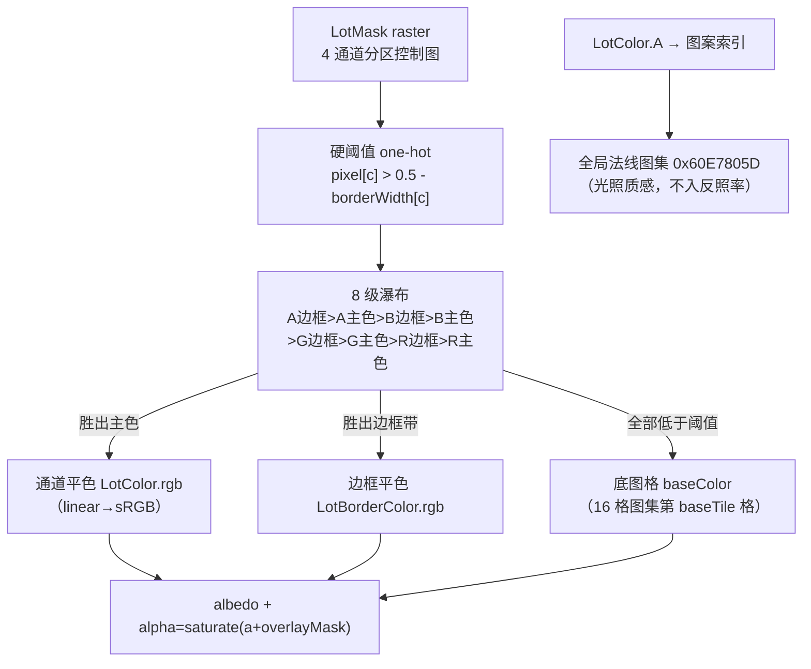

# Lot 地表渲染：LotMask raster 的引擎语义与合成校准

> 本文是 OpenSCP 逆向系列的第四篇，面向 clone / star / fork 本仓库的读者。
> 内容：建筑地块（lot）地表的渲染机制——LotMask raster 在引擎里的真实语义、
> `generic_lot` 像素着色器的完整算法、CPU 侧实例数据构建、朝向约定，以及
> 本仓库按引擎公式做离线合成的校准过程与结论。全部结论来自 shader 反编译、
> 脱壳镜像的 CPU 侧反编译、真实包探针与游戏内截图对拍，只陈述已定案的事实。
> 系列另三篇：[SimCity 游戏整体架构](./simcity-game-architecture.md)、
> [GlassBox 引擎整体架构](./glassbox-engine-architecture.md)、
> [贴花（Decal）渲染管线](./decal-rendering-pipeline.md)。

实现位置：`crates/sc-exporter/examples/lot_composite.rs`（批量原生分辨率合成 +
单 lot 游戏级尺度高清模式）、`crates/sc-exporter/examples/lot_compose.rs`
（单 lot 多假设对照）、`crates/sc-properties`（property 解析）、
`output/lot_hires/`（校准产物与再生成命令）。

---

## 1. 一句话语义

> lot 地表不是"地形控制图"，而是一个**材质分区选择器**（overlay mask）：
> 4 通道各自驱动一片区域，shader 对每像素做硬阈值 one-hot + 固定优先级
> 裁决，把胜出通道的**平色**涂上去；纹理质感不来自漫反射贴图，而来自一张
> 全局共享的**图案/法线图集**经光照显现。

历史上曾把 LotMask 当地形控制图逐像素权重涂色 + 双线性放大（双重模糊），
该方法已证伪废弃——本文 §7 记录校准依据。

## 2. 数据侧：lot property 的授权字段

lot 的全部地表授权住在一个 property 资源（typeId `0x00B1B104`）里
（解析：`crates/sc-properties`；Parent 继承 `0x00B2CCCB` 需先展平）：

| 哈希 | 类型 | 语义 |
|---|---|---|
| `0x0CCB7FD5` | Key → Raster `0x2F4E681C` | **LotMask**：4 通道分区控制图 |
| `0x0CCB7FD4` | Key → RW4 `0x2F4E681B` | **Lot Textures**：共享的 4×4=16 格漫反射图集 |
| `0x0D02D586..89` | ColorRgba ×4 | **LotColor1-4**：每通道颜色（线性空间）+ **A = 图案索引**（非颜色分量） |
| `0x0D7AF042..45` | ColorRgba ×4 | LotBorderColor1-4：边框带颜色（A 同为图案索引） |
| `0x0D7AF046..49` | Float ×4 | 每通道边框带宽度 |
| `0x0D02D58A/B` | Vector4 | colorHeights / borderHeights |
| `0x0CCB7FD6` | Int32 0..15 | 底图格 baseTileUVMinMax.x |
| `0x0CCB7FD2/FD3` | Vector2 | FD6 缺失时的底图格推导源 |
| `0x0CCB7FD0` | Vector2 | 世界锚定细节层平铺尺寸（米/格，默认 8.0；uv1 分母） |
| `0x0CCB7FC8` | Vector2 | LotSize（地块世界尺寸，米） |
| `0x0CCB7FC9` | Vector2 | LotOverlayBoxOffset：地面 quad 中心相对模型 bbox 中心的偏移 |
| `0x0DB7FB17` | Transform | LotPlacementTransform（Module 型锚点各带一份） |

底图格**三级来源**（CPU 侧反编译逐字）：`0x0CCB7FD6`（Int32）优先 → 缺失时由
`0x0CCB7FD2/FD3` 逐分量取 min 后 `round((min+1/64)×4)` 推导（x + y×4）→
顶点侧默认 8.0。真实资产实测两种来源都出现（如 `457EA9DB` 用推导 = 4、
`65A873B3` 用 FD6 = 1）。

**图集体系**：Lot Textures 是全局共享的（两个不同建筑引用同一 instance
`0xA0DA9E6C`）；图案/法线图集与染色图集是全局共享 RW4——法线图集
`0x60E7805D`（1024²×16 格，实测标准 normal map：平坦区 = 128,128,255）、
染色图集 `0x9590D255`。**LotColor.A 索引的是法线图案图集，不是漫反射格**；
两套图集是平行的（同索引描述同种材质），这是"看起来 A 也指向漫反射格"的
成因。

## 3. 像素着色器算法（generic_lot，shader 逐字）

```hlsl
// ① 底图：每 lot 只取图集的一格，整格拉伸铺满地块
baseTileIndex = floor(In.texcoord4.w);
lotBaseUVMin  = float2(frac(baseTileIndex*.25), floor(baseTileIndex*.25)*.25);
baseColor     = tex2D(lotTextureSampler, lerp(lotBaseUVMin, lotBaseUVMin+.25, uv0));

// ② 阈值 one-hot + 优先级链（w→z→y→x）
maskCenters = 0.5 - borderWidth;
masks       = greaterThan(pixelRGBA, maskCenters);          // 逐通道硬阈值
borderChk   = greaterThan(pixelRGBA, 0.5 + borderWidth);
borderMask  = min(1 - borderChk, masks);
// 之后按 w→z→y→x 依次扣除，得到互不重叠的 masks / borderMask

// ③ 胜出通道选图案；颜色按通道相加
index = masks[ch] ? (borderMask[ch] ? borderNormals[ch] : colorNormals[ch]) : index;
overlayNormal = tex2D(lotNormalSampler, cellRect(floor(index)));

lotColor.rgb = float3(dot(colorsR,masks)+dot(bordersR,borderMask),
                      dot(colorsG,masks)+dot(bordersG,borderMask),
                      dot(colorsB,masks)+dot(bordersB,borderMask))
             + saturate(1 - overlayMask) * baseColor;
lotColor.a   = saturate(lotColor.a + overlayMask);
```

要点：

1. **8 级瀑布**：A边框 > A主色 > B边框 > B主色 > G边框 > G主色 > R边框 >
   R主色——每像素至多一个胜出者（含边框带）。
2. **颜色是相加的平色**：某通道生效处反照率就是该通道的平色（linear→sRGB 后
   输出），质感来自 `lotNormalSampler` 图案光照，不另采漫反射。
3. **未覆盖区** = `saturate(1-overlayMask) × 底图格`，底图格数据驱动（§2），
   不是硬编码"草地"。
4. **alpha 输出** = `saturate(a + overlayMask)`——即"只替换有内容区"的替换
   语义。
5. `genericLot*` 共 12 个变体（4ChanOverlay / SDFOverlay / AlphaBase / Lawn /
   Dirt 等）；Lawn 系走生态/草地级联（R×B 得草量、A 为污染掩码）。



## 4. uniform 与 CPU 侧构建（脱壳反编译逐字）

- uniform 结构 `cLotInstanceInfo[14]`（14 个槽位，分配函数 `FUN_008B9D30`）：
  `colorsR/G/B/colorNormalsIdx`、`borderWidthXYZW`、`borderColorsR/G/B`、
  `borderNormalsIdx`、`baseTileUVMinMax`、`overlayTileUVMinMax`、
  `colorHeights`、`borderHeights`——每个都是 float4。
- LotColor 按**列填充**：`LCn → colorsX[n], colorsX[n+4], colorsX[n+8],
  colorsX[n+0xC]`。
- 消费入口：`FUN_008BA1C0`（门控 = bool 属性 `0xEBDFF0C` + 批次键 `0xBBD5875`）。
- **地面恒为 1 个四边形**（4 顶点 × 8 float + 6 索引）：曲线观感全部由 mask
  纹理逐像素表达，弯道 = 道路按段摆放多个各自旋转的 lot 实例
  （`cToolPathPlacer` 读曲率属性做 cos 计算），不存在弯曲网格。
- 顶点格式：`position.xyz | uv0.xy | uv1.xy | baseTile(float)`。uv0 = lot 局部
  0..1（mask 与 16 格图集共用）；uv1 = 世界锚定细节层
  （`corner·axis / 0x0CCB7FD0`，绝对世界投影，跨 lot 连续）；两轴分母均有
  `|v| ≥ 0.1` 除零保护。
- quad 中心 = 模型 bbox 中心，被 `LotOverlayBoxOffset 0x0CCB7FC9` 覆盖——这
  就是建筑相对 lot 的横向偏移量。
- Module 型锚点（`SCUnitIsModule 0xAFE2FEB`）各应用自己的
  `LotPlacementTransform`（`FUN_007E2260`）；不存在 Front/Back 正反面概念。

## 5. 朝向约定（对拍定案 + 引擎字面证据）

```
mask 栅格 → 地块：行序翻转(V) + 列序镜像(U)  等价于把原始栅格旋转 180°
Lot Textures 图集格的 U 轴与 mask 的列序相反（采样 u = 1 − x/W）
```

- 与游戏内截图逐细节比对确认（消防局 `0xE917279C`）；此前只做行翻转导致合成图
  与游戏左右镜像。
- **引擎侧字面证据**：CPU 构建 UV 轴时 `axisB = (−m64, m60)` 首分量位取反
  （`^ −0.0`）——镜像直接编码在引擎自己的轴构造里。
- 本仓库现行前端 `refinedGround` 未做列镜像，输出与游戏整体左右镜像
  （用户截图对拍吻合，属待修项）。

## 6. 通道语义：配对、授权与优先级归属

- **配对已定案**：`mask.R → LotColor1`、`G → LotColor2`、`B → LotColor3`、
  `A → LotColor4`（图书馆游戏内取色判定：LC4 是四色中唯一偏黄的，对应 A 通道
  2.6% 覆盖的细线特征，反转配对判否）。
- **通道语义每 lot 各自授权**，无跨资产惯例：图书馆 R=沥青停车场 / 红十字会
  R=广场铺装 / 消防局 R=草坪 / 线性公园全空 mask（100% 走底图）。
- **优先级链决定真实归属**：不能用各通道原始 `>127` 占比当材质面积。消防局
  各通道原始 R 76.1%，经瀑布解析后归属仅 22.9%——大量像素被更高优先级的
  B/G 抢走。
- 同一 LotMask 被多个 lot 引用时颜色/图案索引各不相同（如 `fa8c9aa7` 的三个
  lot 分别 A=[9,2,1,3] / [6,2,1,3] / [6,2,1,4]）——授权严格 per-lot。
- 注意与贴花预览的优先级**不是同一套**：LotMask 预览路径（`decode_lot_mask_rgba`）
  用 A > R > G > B，lot 地表 shader 用 A > B > G > R——两者是不同消费者
  （详见系列第三篇 §3）。

## 7. 离线合成的校准（本仓库探针）

### 7.1 被证伪的方法

早期探针把 LotMask 当地形控制图：a⁴ 权重羽化 + 逐像素多色混合 + 双线性放大
后再合成——输出双重模糊、无引擎对应关系。该路径已删除。

### 7.2 正确口径（lot_composite.rs）

- **批量模式**：在 mask 原生分辨率上合成（每 texel 一像素，PNG 仅最近邻放大），
  硬阈值 + 8 级瀑布 + 平色（linear→sRGB）+ 边框带 + 底图格；每 lot 一张
  （颜色/底图格是 per-lot 数据）+ 通道归属诊断图 + contact sheet。
- **高清模式**（`--lot=<hex> --ppm=32 --out=<dir>`）：按 LotSize（米）定长宽比
  与像素密度（超 4096 等比缩），mask 用 GPU 口径双线性采样——**阈值在插值之后
  逐像素施加**，这与被证伪的"先放大后合成"不同，是引擎消费 mask 的实际方式；
  alpha = overlayMask；图案质感 = 法线图集坡度明暗（近似 lotCalcLighting）。
- 已修复的实现错误（供后来者参考）：合成输出漏 linear→sRGB 编码（全图暗一半，
  平色 140 输出 71，量化对拍抓到）；超 4096 上限时两轴独立钳制破坏长宽比
  （应等比缩）。

### 7.3 校准产物与交叉验证

- 8 个代表性 lot 的高清合成 + 120 lot 批量 contact sheet 在 `output/lot_hires/`。
- 交叉验证实例：市政厅族 lot `457EA9DB`（模型 `0x01532F56` 为其 LOD1）的
  LotColor.A = 3/1/8/3 与反编译填充表推导一致；mask `ee9e76d3` 256×128、
  底图格 FD2/FD3 推导 = 4、LotSize 192×96 m。
- **tile×tint 双重变暗实证**：按"漫反射平行格 × LotColor 染色"合成（渲染器
  旧语义）整体显著偏暗（右侧暗区接近全黑——该格漫反射图本身近黑），证明引擎
  覆盖区不采样漫反射——平色 + 法线图案才是正确语义。
- **镜像实锤**：探针输出（按 §5 朝向）与现行渲染器输出整体左右镜像。

## 8. 复现

```bash
# 批量：120 lot 原生分辨率 albedo/selector + contact sheet
cargo run -p sc-exporter --release --example lot_composite

# 单 lot 游戏级尺度高清合成（pattern=引擎口径 / tile=对照口径）
cargo run -p sc-exporter --release --example lot_composite -- \
  --lot=457ea9db --out=output/lot_hires

# 单 lot 多假设对照（底图格推导、通道统计、图集格均色）
cargo run -p sc-exporter --release --example lot_compose -- \
  "D:/ea-games/SimCity/SimCityData/SimCity_Game.package" 0x457ea9db \
  --out=D:/tmp/lot_compose "D:/ea-games/SimCity/SimCityData/SimCity_Graphics.package"
```

---

*系列导航：[SimCity 游戏整体架构](./simcity-game-architecture.md) ·
[GlassBox 引擎整体架构](./glassbox-engine-architecture.md) ·
[贴花（Decal）渲染管线](./decal-rendering-pipeline.md)*
