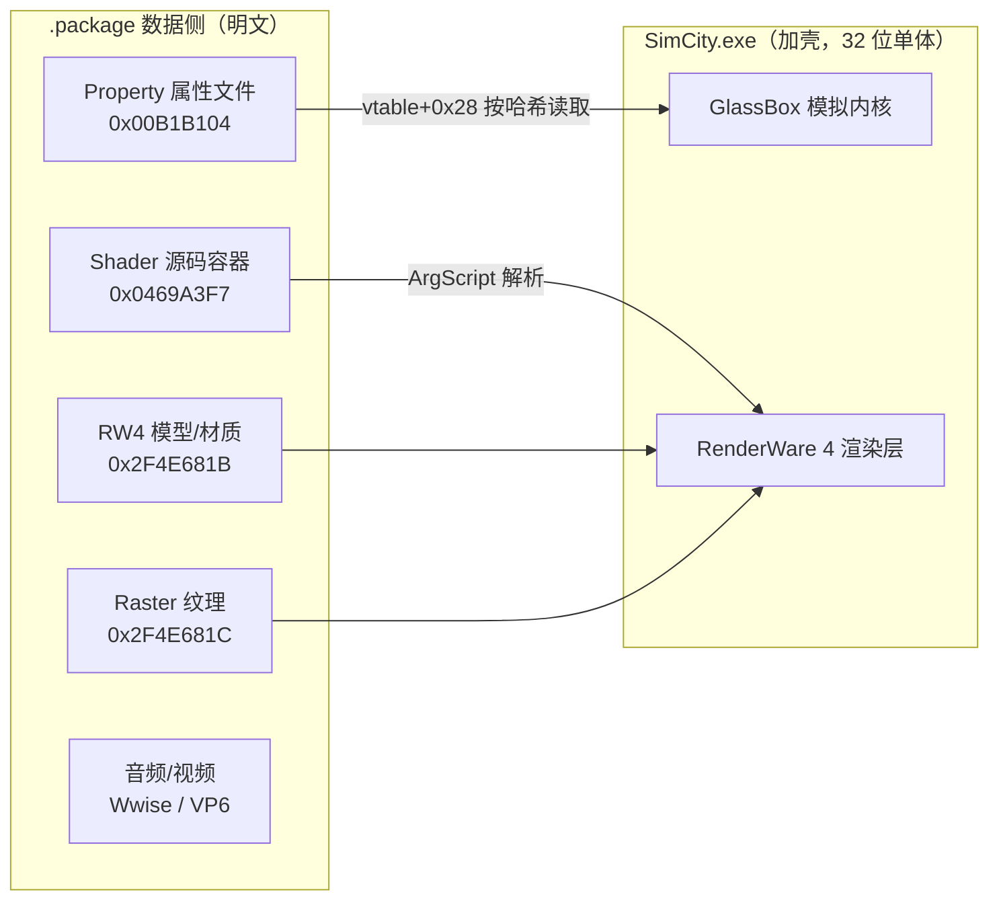
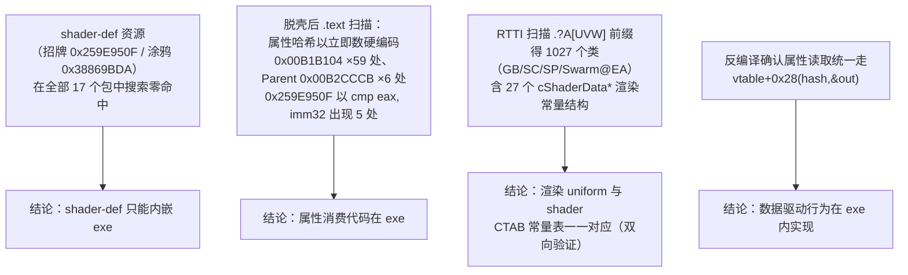
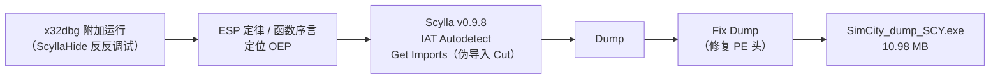

# SimCity（2013）游戏整体架构：从数据包到引擎本体

> 本文是 OpenSCP 逆向系列的第一篇，面向 clone / star / fork 本仓库的读者。
> 目标：讲清这款游戏在磁盘上是什么、数据如何组织、引擎本体在哪里、我们是
> 怎么确认的、以及把引擎代码拿到手（脱壳 + 反编译 + 动态探针）的完整流程。
> 全文只陈述已经用证据定案的事实。系列另两篇：
> [GlassBox 引擎整体架构](./glassbox-engine-architecture.md)、
> [贴花（Decal）渲染管线](./decal-rendering-pipeline.md)。

仓库实现：`crates/dbpf`（DBPF 容器）、`crates/rw4`（模型/纹理）、
`crates/sc-properties`（属性系统）、`crates/sc-exporter`（导出探针）、
`src-tauri`（应用后端）。

---

## 1. 总览：单体 exe + 全量数据驱动

SimCity（2013，Maxis/EA）的形态可以概括为一句话：

> 一个加壳的 32 位单体可执行文件（SimCity.exe，内含全部引擎与模拟逻辑），
> 加上一套全量数据驱动的 `.package` 资源包——行为参数、资产、UI、甚至
> shader 源码，全部是明文数据。

- 游戏没有独立的引擎 DLL，引擎本体（GlassBox 模拟内核 + RenderWare 4 渲染层）
  全部编译在 SimCity.exe 内。
- 原版 SimCity.exe 是加壳发行：`.text` 段熵值 8.00（整体加密），`.data` 段同样
  加密。而 `.package` 侧全部是可离线解析的明文数据。
- 这个"数据侧明文 + 代码侧加密"的划分，是整个项目可行性的基础：
  **从数据侧即可重建引擎的大部分行为**（见 §6 的证据链）。



## 2. 磁盘布局与包分工

游戏数据目录为 `SimCityData\`，资料片（Cities of Tomorrow）数据在
`SimCityDataEP1.package`。mod 的三类安装位置：数据类 `.package` 放
`SimCityData\`；普通脚本包放 `SimCityUserData\Packages\`；游戏脚本包
（`Simcity*-Scripts_*.package`）放 `SimCityUserData\EcoGame\`。

对全部 17 个包的普查结论：**48,759 个资源、解压后 4.99 GB，可识别类型占容量
99.45%**，未识别的 0.55% 全部在 EP1 包内。

| 包 | 内容 |
|---|---|
| `SimCity_Game.package` | 地块地形层栈模板、UI 布局资源、菜单 property、7 个贴花字典（decal atlas） |
| `SimCity_Graphics.package` | 2267 个建筑模型（全部带 TANGENT0 顶点流）、全局法线图集 `0x60E7805D` 与染色图集 `0x9590D255` |
| `SimCity_App.package` | UI/道具模型、CSS/JS 界面资源，以及 **shader 源码容器**（typeId `0x0469A3F7`，32 个共 37 MB） |
| `SimCityDataEP1.package` | 资料片模型/材质主体 |
| `SimCity_DLC0.package` | 785 个 RW4 资源、565 个 mesh |
| `SimCity_RegionTerrain0/1.package` | 区域背景地形（基础游戏 11 区 / EP1+DLC 4 区），高度图 + 场图共约 750 MB |
| `SimCityUserData\` | 用户数据：偏好设置（Preferences.prop 是迷你 DBPF）、EcoGame 脚本包、图形缓存 |

## 3. DBPF 容器格式

所有 `.package` 都是 DBPF 容器（magic `DBPF`，另有 120 字节大头的 DBBF 变体）。

- 索引条目为 **TGI 三元组**（Type / Group / Instance 各 u32）+ offset / 压缩大小
  / 解压大小 / 压缩标志。零售包头部约定已逐字节标定：major version = 3，
  索引前导 8 字节（values=4 + shared=0），每条索引记录 28 字节；索引头位标志
  决定省略字段（bit0 typeId / bit1 group / bit2 unknown）。
- 条目压缩 = **RefPack**（EA 家族通用压缩：命令分支 + 重叠拷贝）。实测 App 包
  1260 条 RefPack 流全部解压到索引声明的精确大小，纯 Rust 实现吞吐约 860 MB/s。
- 写回：`dbpf::write_uncompressed_overlay` 生成确定性未压缩 overlay——条目按
  TGI 排序、拒绝重复 TGI、头部逐字节镜像零售包格式。改官方资源 = 就地改基础包
  （文件末尾追加未压缩负载 + 改写索引记录）。

```rust
// 索引记录（28 字节/条）
struct IndexEntry {
    type_id: u32,          // 资源类型（如 0x2F4E681B = RW4）
    group_id: u32,         // 组
    instance: u32,         // 实例 ID
    offset: u32,
    size_compressed: u32,
    size_decompressed: u32,
    compression_flags: u16,
    flags: u16,
}
```

## 4. 资源类型体系与 s3db 描述符库

游戏自带一份官方描述符库 `database_main.s3db`（SQLite），六张表：
FileTypes / GroupTypes / Groups / InstanceTypes / Instances / Properties。
真实库验证含 **11,321 个实例、464 条属性描述符**；仓库把 493 KB 的 bundle 版
打包在 `src-tauri/resources/`，样本在 `docs/packages/database_main.s3db`。

哈希命名规则（已程序化验证）：

- **Instances 表 72% 的 ID = FNV-1（32 位）of 小写名称**（offset basis
  `0x811C9DC5`、prime `0x01000193`，乘后异或字节）——名称 → ID 可以离线计算。
- **Properties 表的 ID 是分配式的**，不是名称哈希——这解释了为什么引擎代码里
  用立即数（见 §6）注册属性。
- 跨模块常量（fourCC 风格的属性/消息哈希）是 Maxis 私有算法：FNV-1 / FNV-1a /
  CRC32 / Jenkins / djb2 均不匹配。

## 5. Property 系统：游戏的数据中枢

资源类型 `0x00B1B104`（s3db 名 "Property File"）是数量第一的资源（全库 13,618
个 / 30 MB）——建筑、道具、地块、菜单、代理参数、规则引用全部住在里面。

二进制布局（全大端，`crates/sc-properties`）：

- `u32 count`，之后每条：`u32 hash`（**大端存储**，探针实证大端扫描 46 命中 /
  小端 0 命中）+ `u16 type_id` + `u16 flags`（bit 标志区分标量/变体、数组/空）；
  数组为 `i32 count + i32 item_size + 值序列`。
- 值类型：Bool / Int32 / UInt32 / Float32 / Float64 / String8 / String16 /
  **Key（TGI 引用）** / Int64 / Uint64 / Vector2/3/4 / ColorRgba / Transform。
- **Parent 继承**：每条 property 可带 `0x00B2CCCB`（Parent）指向另一条；本级键
  优先、父级补缺、逐级递归。四个主包的 10,625 个 property 中 78% 带 Parent——
  解析任何 property 都应先展平继承链。

引擎读取属性的方式统一为 `vtable+0x28(hash, &out)` 调用 + 类型 tag 校验 + 默认值
回退。典型例子：Vehicle 对象 `+0x2b0 = 6000` ← 属性 `0xF10FCFC` 缺失时的默认值。

## 6. 引擎本体在 SimCity.exe：证据链

"引擎在 exe 里"不是假设，是一条可以逐环验证的证据链：



各环细节：

1. **资源反证**：材质第 0 号引用槽（slot `0x2D`）指向 "shader-def" 资源，但
   Game / Graphics / App / Locale / RegionTerrain 全部包中搜不到它——它不在
   数据侧。后续用 Frida 堆扫描在运行时内存命中 802 处，并确认其运行时形态是
   "哈希 → 效果表" 加载期组装。
2. **立即数证据**：脱壳 exe 的 `.text` 中，lot 属性哈希以指令立即数出现
   （`0x00B1B104` 59 处、`0x00B2CCCB` 6 处、招牌 shader-def `0x259E950F` 以
   `cmp eax, imm32` 形式 5 处）。全 `.text` 共扫得 6,445 处大立即数比较。
3. **RTTI 证据**：对 dump 做 `.?A[UVW]` 前缀字符串扫描得到 1027 个类
   （GB 85 / SC 325 / SP 37 / Swarm@EA 13 是命名空间代表），其中
   `cGameManager`、`cTransportPipe`、27 个 `cShaderData*` 渲染常量结构
   （与 shader 的 CTAB 常量表一一对应，是 exe ↔ shader 双向验证锚点）。
4. **反编译证据**：`docs/source-code/` 存有 348 个 IDA 伪 C 文件
   （5110 个虚函数、346 个类）；属性读取统一走 `vtable+0x28(hash,&out)`；
   材质创建 `FUN_006D5540`、属性注册 `FUN_0081D680`、注册表 getter
   `FUN_00422F90`（= `[id*4 + 0xE705A8]`）。
5. **反面证据**：`kRuleID` / `kResourceID` 哈希常量在 exe 指令中 **0 命中**
   ——模拟规则的注册是表驱动的（哈希存于数据表而非代码立即数）。这正是
   "从数据侧即可重建引擎行为、不依赖脱壳"的根本前提。

## 7. 脱壳与逆向工作台

### 7.1 三个 exe 的关系

| 版本 | `.text` 熵 | 说明 |
|---|---|---|
| 原版 | 8.00 | 加壳整体加密（`.data` 同样 8.00，这也是 dump 的 `.data` 断档根因） |
| 离线破解版 | 6.59 | 已脱壳镜像（离线破解本质 = OEP 脱壳 + 修复），与 dump 段表一致，同构建（2014-04-22） |
| `SimCity_dump_SCY.exe` | 6.59 | 自制动态脱壳 dump；`.text` 与破解版 **99.9998% 一致（仅 20 字节差）** |

破解版与 dump 的 20 字节差异全部在入口点：破解桩 = `call [LoadLibraryA]
("1911.dll")` + `jmp 真 OEP`。因此基于 dump 建立的 Ghidra 工程对离线版
exe 100% 有效。

### 7.2 脱壳流程（x32dbg + Scylla）



### 7.3 Ghidra 工作台

- 离线版 **无 ASLR（DYNAMICBASE=0）、无 DEP、ImageBase = 0x400000** →
  Ghidra 地址 = 运行时 VA 直连（Frida `Interceptor.attach` 可直接用
  `FUN_00437610` 这类符号）。
- 地址约定：Ghidra 地址 = dump RVA + 0x400000；注意 file offset ≠ RVA
  （`.text` 起点差 0x400）。
- 工程用 `analyzeHeadless` 批处理：`tmp/ghidra_scripts/OscpDump.java` 支持
  `--allsymbols`（导出 26,340 个类限定符号）/ `--symbols` / `--vtable` /
  `--refs` / `--rva` 多模式，每模式异常隔离，一轮 4–6 分钟。
- 配套定位脚本：先在 `.text` 扫目标哈希的立即数得到 RVA，再对该 RVA 做调用方
  反编译（lot 链、decal 链都是这么定位的）。
- 已知边界：dump 的 `.data` 只到 0x00C44000；真正的离线盲区是 `.data` 运行时
  尾区（VA 0xE4EA00..0x1044000，约 2 MB BSS），需要运行时 dump 补充；
  `.rdata` / `.data` 已初始化区可离线读取。RTTI 离线重建产物
  `tmp/rtti_vftables.json`（884 类 / 1243 个 vftable）。

## 8. Frida 动态探针

静态反编译之外，`tools/dynamic/` 用 Frida 17 对运行中的游戏做观察：

- **spawn 模式**：让 Frida 创建挂起进程、从第 0 字节开始观察，随行捕获游戏自己
  调用的 `Direct3DCreate9`——attach 模式必然晚于设备创建，spawn 是唯一无竞态
  路径。
- **安全模式规则**（实测教训换来的）：钩子数 ≤ 10（万级钩子 sweep 实测约 1600
  个时崩溃）；禁止对未验证对象调用 NativeFunction；回调只计数；
  **`Memory.scanSync` 已禁用**（枚举时堆页释放导致原生级崩溃，两次复现），
  替代方案是 16 MB 分块 `readByteArray` + JS 内匹配（1447 MB 全堆约 90 秒、
  零崩溃）+ 扫到即落盘。
- **D3D9 COM 层是烟幕**：`d3d9.dll` 头部是导入跳转表伪 vftable、设备类无
  RTTI，RTTI 定位路线不可行；全槽位 sweep（28 候选 × 0..110 = 3108 钩子）零
  shader 产出。最终结论：渲染走 RenderWare 4 自己的设备抽象（vftable 在
  SimCity.exe 内），shader-def 的运行时分发是 `.text` 硬编码 cmp 链，
  **静态可分析**。
- 活体成果：引擎注册表 `0xE705A8` 256 KB 全表 dump（16,919 个非空条目）、
  水面类实例（`cTessendorfWater`，参数与 `cShaderDataWater*Info` 交叉验证）、
  地形/着色对象、区域对象、shader-def 变体效果对象（招牌 6 变体 / 涂鸦 5 变体）
  等。

**09-30 追加（实战检验与修正）**：

- **frida 17 已删除 `Memory.readByteArray`**（调用抛 `TypeError: not a
  function`，被 `catch` 吞掉 = 扫描假零）——上文"16 MB 分块 readByteArray"
  今日不可用；替代：`addr.readByteArray(len)` 指针方法、`Memory.scanSync`
  抽样（仍只读安全）、或外部 `ReadProcessMemory`（`external_device_scan.py`，
  零注入零干扰，实测稳定）。升级 frida 大版本后第一步先做 API 存在性对照。
- **d3d9 烟幕结论终局实证**：预算内钩子（活钩 ≤6）武装于堆构/rdata vftable
  设备（`0x2072ff7c`/`0x6c2b1490`，Present 帧率 2679/30s）后零状态调用——
  d3d9 层可见设备全部为**资源/呈现辅助**；加载期接口（bind@98:35582o/
  create@80:8672b）进城后即释放。城市渲染确实不经 d3d9 COM 层，与"渲染走
  RW4 设备抽象"互证。
- **钩子预算量化**：活钩 ≤6、计数窗 ≤10s、先计数后武装、用完即 detach、
  城内不新增钩子——热槽每调用 JS 回调在千次/秒流量下必烧 CPU（三次崩溃
  换来的边界）。单会话锁 `capture.lock` 机制化（双宿主叠加即拒绝）。
- 状态追踪表：`docs/runtime-capture.md`（A-G 清单 + 废弃建筑歪斜/半边窗
  复现等新增目标）。

## 9. Shader 源码就在包里

虽然 shader-def 在 exe 里，但 **HLSL 源码本身是明文数据**：typeId `0x0469A3F7`
的容器（SimCity_App.package，32 个 / 37 MB）结构为 ArgScript 片段串联：
`[片段名][二进制元数据][HLSL 代码][uniform 声明]`，两种形态并存——约 8 MB
编译字节码（带 CTAB 常量表）+ 约 1.2 MB 纯 HLSL 源文本（vs_3_0 / ps_3_0，
编译器 Microsoft HLSL 9.29.952.3111）。

`hlsl_dump` 已把全部容器转储为文本；26 个 building4 家族 shader、12 个
`genericLot*` 变体、18 个 decal 族 shader 全部由此复原。这一事实把
"渲染语义"从黑盒变成了可 grep 的文本——本系列第三篇（decal 管线）和
lot 地表的引擎公式都直接受益。

## 10. 生态规则：mod 只增不覆盖

- 文件投放**只支持新增、不支持覆盖**：三种位置/命名实测全部无效；后投放的包
  无法覆盖既有 TGI（对应引擎路径初始化函数 `FUN_00403FB0`）。检查过的社区
  mod 包也全是新增 TGI；改官方资源的社区工具（如 SCTweak）是直接改基础包。
- 离线存档（`Documents\SimCity\Games\<GUID>\<boxId>\`）不含 DBPF：
  `misc/MetaData` 是纯 JSON 区域清单；`state_file_<n>_<ts>.egb` 是 gzip 的
  城市状态快照（解压头含主规则库 instance `622B9CD7`，即"存档 = 规则库的
  状态投影"）；`SLDelta*.mfs` 是二进制增量。

---

*系列导航：[GlassBox 引擎整体架构](./glassbox-engine-architecture.md) ·
[贴花（Decal）渲染管线](./decal-rendering-pipeline.md)*
