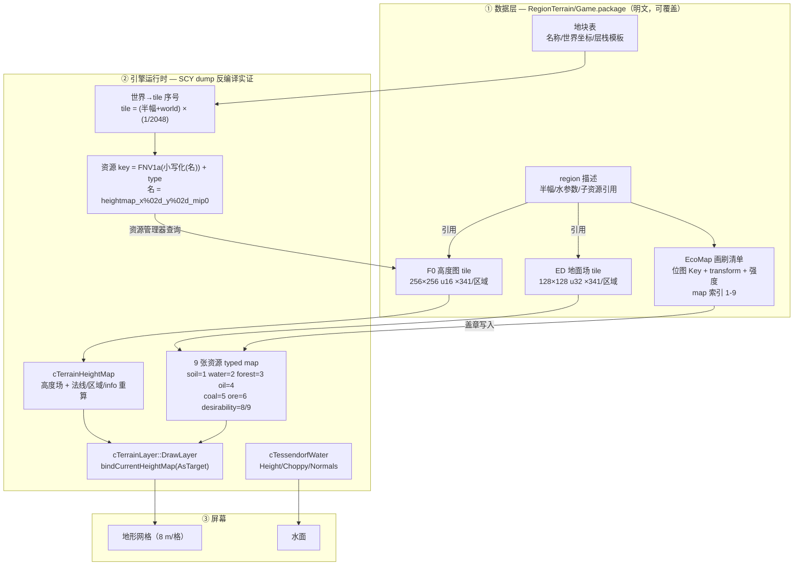
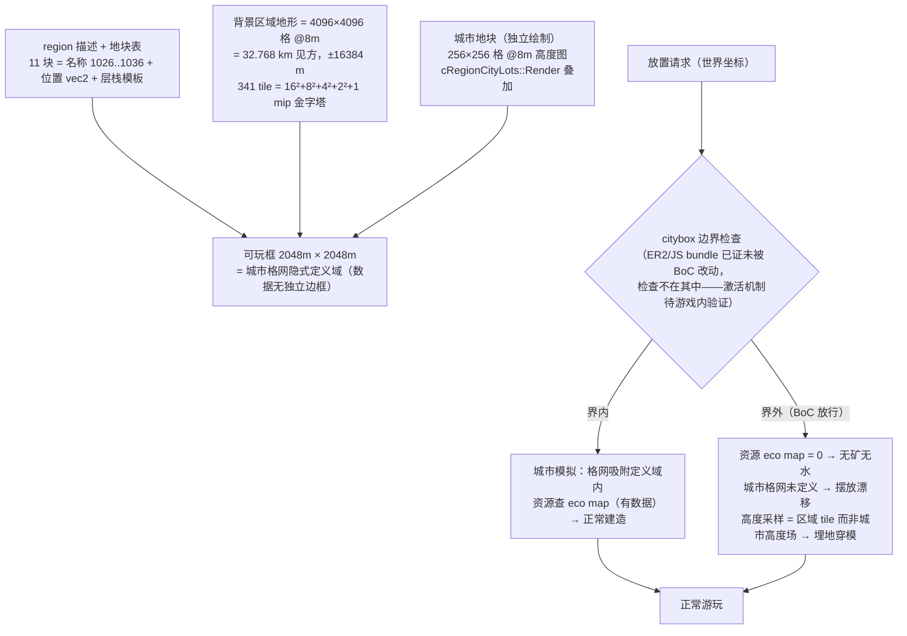

# 区域与地图机制 — RegionTerrain / 城市地块 / 可玩边界

> 调查笔记（2026-09-22，同日三次更新：tile 排布破解（mip 金字塔）+ BoC 全量取证）。
> 动机：BoC（区域外可建设模组）只移除了可玩边框，但界外建造存在「摆放漂移 /
> 无地下资源 / 建筑埋地穿模」三类缺陷——本文从数据与引擎两侧厘清地图机制，
> 回答「大地图如何切成小地图」「地图尺寸是引擎写死还是数据驱动」，并给出
> OpenSCP 的可行路线。
> 工具：新增探针 `crates/sc-properties/examples/region_probe.rs`
>（survey / dump / props / hstats / tilecheck / extract / full / refs /
>  matchstate / jigsaw / grid 共 11 个子命令）、`tile_grid.rs`（索引序网格渲染）、
> `pkg_diff.rs`（整包逐条目对比）、`prop_diff.rs`（property 语义级 diff）、
> `tile_pyramid.rs` / `tile_arrange.rs` / `tile_orient.rs`（mip 金字塔匹配与
> 16×16 排布还原）、`namehash_probe.rs`、`inst_reuse.rs`、`find_group.rs`。
> 置信度标注沿用 [glass-box/terrain.md](./terrain.md)：**[高]**=字节级实证，
> **[中]**=结构推断，**[低]**=推测。

## 0. 机制总览图

### 图 A：地图渲染机制（数据 → 引擎 → 屏幕）



### 图 B：可游玩区域机制（地块 / 边界 / 界外缺陷根源）




## 1. 数据源盘点 [高]

| 包 | 内容 |
|---|---|
| `SimCity_RegionTerrain0.package` | F0 3846 条（504 MB）· ED 3751 条（245 MB）· property 282 条 → **基础游戏 11 个区域** |
| `SimCity_RegionTerrain1.package` | F0 1399 条 · ED 1364 条 · property 111 条 → **EP1/DLC 4 个区域** |
| `SimCity_Game.package` | 地块地形层栈模板（group D7EF2862 族）等 |

类型语义（`verified_type_name`）：
- `0x03E421F0` **Terrain Heightmap (16-bit)**：解压恒为 **131,092 B = 20 B 头 + 256×256 × u16 LE**；
- `0x03E421ED` **Terrain Field Map**：65,556 B = 20 B 头 + 128×128 × u32（头部 BE u32 "128/128/2"）；
- property（0x00B1B104）承载全部区域/画刷/地块描述。

## 2. 高度图解剖 [高]

头部 20 B：`00 00 00 00 | 00 00 01 00 | 00 00 01 00 | 00 00 00 07`——
65536（=0x10000，格子总数）与 256 出现于定长字段，末尾 u32=7 疑为格式 id。

数值实证（hstats，u16 LE）：

| 地块 | min | max | 特征 |
|---|---|---|---|
| BC357A2B:D6DCB06E | 2155 | 5399 | 海岸城（基准面 ≈2000+） |
| A0B60DDE:EB0FF21B | 3021 | **16218** | 山地 |
| BEAF0510:DB206CE6 | 0 | 0 | **全 0**（未使用/预留地块） |
| BEAF0510:AB991ED8 | 0 | 25573 | 陡崖（nonzero 仅 2719 格） |

垂直比例（u16 → 米）未定（见 §12.1）；水平方向：地形格边长 8 m（terrain.md §2.6，
LotMask 96 m = 12 格 × 8 m 互证 [中→高]；§4.2 的 1/2048 换算常数再证 [高]）。

## 3. 区域组织：group ≈ 区域 [高]

- RT0 的 F0 按统计落为 **11 个"大 group"（各 341 张高度图）+ 95 个"单条 group"**；
  ED 恰为 11 个大 group × 341（无单条）——**每区域 341 对 (F0 高度图 + ED 地面场)**；
- 每个大 group 恰有一条 **`…:51E7A18D` "region" 描述 property**（34 键）：
  常量（1024、-870、32768、40、60、2/5/6、种子 257368037、布尔）+ **~14 个 Key
  引用子资源**——正好对应 [terrain.md](./terrain.md) §1.2 的 **13–14 张 typed map** 槽位；
- 子资源全家福（按 `0x00B2CCCA` 名称字符串）：
  `heightmap`（地形画刷清单）· `watertableheightmap`+`waterTableEcoMapBrushes` ·
  `coalheightmap`+`coalEcoMapBrushes` · `oreheightmap`+… · `oilheightmap`+… ·
  `soilheightmap`+… · `forestheightmap`+… · `desirabilityheightmap`+`desirabilityEcoMapBrushes` ·
  `desirabilityTwo…` · `tessendorfWater`（水面参数）· `terrainEditor` · `grass` ·
  `environment` · **城市地块表**（§6）。
- 95 个单条 group = 各区域**城市地块组**（2026-09-22 实证）：每个城市地块是一个
  独立 group，内含**该城自己的 256×256 高度图** + 一条 36 B property
  （`0x1B53D525 int32` + `0xC1949C4D Key` 回指本区域 region 描述
  `00B1B104:D01FA985:51E7A18D`）——**地块 group 里没有任何尺寸/边界数字，
  城市范围 = 高度图域本身的隐式定义**；95 ≈ 11 区域 × 8.6 块/区域，
  与地块表 11 块/区域量级吻合 [高]。

## 4. 区域地形：tile 分块存储 + 画刷盖章 [高]

> 本节「画刷盖章」只覆盖已见到的画刷清单（每区域仅 2 笔地形画刷）；
> 2026-09-22 记账已闭合：341 张 tile **不是**画刷产物，而是区域高度图的
> mip 金字塔（§4.1）；画刷 stamp 只负责少量局部特征（stamp 位图资源本身
> 尚未在包内定位，§12.1）。

地形画刷清单（例 BC357A2B:3BABB8DB）：

```
0x00B2CCCA string8 = brushes          ← 画刷清单
0x02A907B5 Key[2]  = C175ACEA, 282078BF   ← 指向本区域 group 的 F0 高度图块
0x02A907B6 transform[2] = 平移 (813.29, 2168.00) / (-2035.99, -203.31)
0x0DBA3A9C string8 = heightmap        ← 目标 map 名
0x0DC097E3 uint32  = 256              ← 贴图分辨率
```

**边缘连续性检验（tilecheck）**：同区域相邻块 EB0FF21A → EB0FF21B

```
A.right vs B.left   avg|Δ| = 22.2   ← 与 A 自身 right/left 差 24.2 同级 → 连续！
A.left  vs B.right  avg|Δ| = 6520.4 ← 反向/上下缘 514~3019 → 不连续
```

### 4.1 tile 的空间排布：**已破解 — 341 tile = mip 金字塔**（2026-09-22）[高]

> 历史：此前一版曾用"贪心边缘匹配 + BFS"自动拼合并声称拼出连贯大地图——**该结论
> 有误，已撤回**（低频平坦地形边缘歧义导致假阳性）。真正解法与边缘无关。

**结构实证（tile_arrange 探针，像素级验证）：**

1. **341 = 256 + 64 + 16 + 4 + 1 = 16² + 8² + 4² + 2² + 1²** ——每区域 341 张
   tile 是一张 **4096×4096 格区域高度图的完整 mipmap 金字塔**：
   mip0 = 16×16 张 256²（覆盖 32768 m，即 ±16384 m @8 m/格），
   mip1 = 8×8，mip2 = 4×4，mip3 = 2×2，mip4 = 1×1；
2. **父 tile 每个象限（128×128）= 某子 tile 的 2×2 box 降采样**，误差
   0.06–3 个高度单位（次优候选差 10–2000 倍），金字塔逐级匹配在
   BC357A2B（海岸城）与 A0B60DDE（山地）两区域均**完整复原：
   节点计数 [1,4,16,64,256]、单根 0x7ADCBE88、零拒绝、零孤立**；
3. **instance id 是区域无关的"槽位 id"**：RT0 的 3846 条 F0 只有 **342 个
   唯一 instance**（341 金字塔槽 + 1 城市图），每槽被 11 个区域 group 复用
   （各自携带本区域数据）；ED 3751 = 11×341 完全同构；
4. 记账闭合：**F0 3846 = 11×341（金字塔）+ 95（城市地块图）**；
5. 与 §4.2 引擎公式闭环：`tile = (regionExtent/2 + world) × (1/2048)`，半幅
   16384 → tile 序号 ∈ 0..15 **正是这 16×16 网格**；`heightmap_x%02d_y%02d_mip%d`
   名字哈希索引的 (x,y,mip) 即金字塔坐标（包内 instance 不是该哈希，
   0..63 域穷举未命中由此解释——引擎按名字索引运行时缓存/加载层，包内用
   原始槽位 id）。

**16×16 mip0 排布（BC357A2B 海岸城区域，tile_arrange 还原；行=金字塔 y）：**

```
grid avg-height（×100）：外圈 ~5300 浅海，中央 2600 深水盆地 + 8800-14100 山体，
海岸线跨 tile 边界完全连续——拼合即成图，无需任何边缘匹配。
```

- **待定（仅剩方向约定）**：金字塔象限 → 世界坐标 (x 增/y 增) 的朝向。
  2026-09-23 进展：**F0 朝向已按地标对照初步定案 = identity（拼合图与游戏
  区域视图同向，无翻转）**——用户提供的游戏内截图（EP1 区域 test_001，
  5 个可玩位 + 分叉河流三角洲）与拼合渲染图三方吻合：山脉弧在左上、
  河流分叉在右中、河口在右下。区域判定 test_001 ≈ **9F735B20**（RT1，
  8 地块中 5 未认领 + 2 伟大工程 + 2 已建）；平坦度判据与 ED 道路落陆
  判据均与 identity 相容（rot180 略差）。最终仍需截图-渲染叠合一次确认；
  **ED 的相对帧待定**（identity 与 rot180 证据相抵）。
- **ED 独立槽位命名空间**（2026-09-23）：ED（0x03E421ED）的 341 个 instance
  与 F0 **交集为 0**——地面场是另一套槽位 id、自持独立金字塔
  （lane0+lane2 联合降采样匹配同样单根复原，`ed_render` 探针）；
  ED u32 = 3 个有效字节（b0=森林/道路密度场：有机噪声斑块 + 细线路网；
  b2=地形材质/水场；b1 少量；b3 恒 0）。
- **树木纵向条纹 = 渲染侧产物，非拼接痕**（2026-09-23 回答用户观察）：
  ED 森林密度为连续噪声斑块，跨 tile 边界完全连续（金字塔匹配本身即证
  无缝），数据侧无任何周期带状痕迹；游戏内所见成行树木是渲染器实例
  排布网格（billboard 行/LOD 采样）所致。
- [x] ~~画刷 stamp 位图命名空间~~ **已定案**（§5）：全部 stamp 位图（地形+
  资源）均不在任何 package 内（含资源类 stamp 的补充验证），Key 无
  type/group——运行时按区域种子程序化生成；包内硬数据 = 位置/强度/目标 map。
- 曾有假设"tile 头部 20 B 含位置字段"确认无误：头部仅 256×256 与格式 7，
  排布信息由金字塔结构自携带。
- **共享网格已跨包实证**（2026-09-23）：RT0 与 RT1 的 341 槽位 instance
  集合完全一致（slot_compare）——排布全游戏唯一，BC357A2B 完美树可直接
  渲染全部 15 个区域（`region_preview` + `grid_shared.txt`）；EP1 四区域
  逐区独立匹配会因平坦海域歧义产生环/多根，须用共享网格。

### 4.2 世界坐标 → tile 换算（Ghidra 反编译 FUN_00beb730）[高]

```c
fVar8  = regionExtent * DAT_00da307c;            // DAT_00da307c = 0.5 → 半幅
tileX  = (int)((fVar8 + worldX) * DAT_00d9e8a4); // DAT_00d9e8a4 = 1/2048
tileY  = (int)((fVar8 + worldY) * DAT_00d9e8a4);
FUN_00beb470(buf, tileX, tileY, /*mip=*/0);      // "heightmap_x%02d_y%02d_mip0"
```

- `.data` 实测：`DAT_00d9e8a4 = 0.00048828125 = 1/2048`、`DAT_00da307c = 0.5`
  —— **一个地形 tile = 2048 m × 2048 m**；
- 城市格 256×256 → **格边长 = 2048/256 = 8 m**（terrain.md 假设转正 [高]）；
- **该公式即 §4.1 的 16×16 金字塔索引**：区域半幅 16384 m →
  `(16384 + world) / 2048 ∈ 0..15`；同一公式对城市（半幅 1024）恰好命中
  其唯一 256² tile——城市与背景共用一套 tile 寻址 [高]；
- 地块表坐标（±6704 m）落在区域背景 mosaic 中央 ~1/5 范围内；背景 mosaic
  总覆盖 ±16384 m（§4.1 已标定）；区域描述中的常量 **16384 / 32768**
  （0x5E3D16DF / 0xB0AAB5B1）= 区域半幅/全幅 [高]；
- 地形查询按名字（含 tile 坐标）走资源管理器——tile 的存取是**数据驱动**；
- 运行时高度公式（`fStack_28 = DAT_0103d444 * 0.5 + DAT_0103d448`）的常量在
  BSS/未转储区，垂直比例仍待动态脱壳定量。

## 5. 资源分布（EcoMap 画刷）[高]

> **2026-09-23 重大澄清：画刷位图不在包里，资源是运行时程序化生成。**
> 全部画刷 stamp 位图（地形 C175ACEA 类 + 资源 AA7731CE/CE1B4BC1/917035EE…
> 等全部实例）在 RT0/RT1/Game/EP1 的**全类型 instance 搜索均为空**；
> Key 无 type/group 字段。结合区域描述中的种子字符串，判定 stamp 位图由
> 引擎按种子程序化生成，包内只存**位置/强度/目标 map**这些硬数据。

每区域 9+2 类资源/覆盖图，全部走同一套画刷机制：

```
0x00B2CCCA string8   = 清单名（oilEcoMapBrushes / coalEcoMapBrushes / …）
0x02A907B5 Key[N]    = 位图引用（程序化生成，不在包内）
0x02A907B6 transform[N] = 世界摆放（平移 + 旋转；Count=12，尾浮点=强度/比例）
0x0DBA3A9C string8   = 目标 map 名（"oilheightmap" / "watertableheightmap" / …）
0x0DC097E3 uint32    = 128（分辨率）
0x0DE43899 uint32    = 目标 map 索引：soil=1 watertable=2 forest=3 oil=4
                       coal=5 ore=6 radiation=10 groundPollution=11 desirability=8/9
```

test_001（9F735B20）画刷清单实证：oil×2、coal×1（东北远郊 3712,2692）、
ore×1、watertable×1、soil×1、forest×1、radiation×2、groundPollution×1、
desirability×2、地形×2——**位置是硬数据，可精确标绘**（region_color 探针
已画环叠图）；blob 形状/数值分布需运行时或存档对照标定。

**对全地图可玩 mod 的推论 [高]：**

1. 城市地块 group 内**没有任何资源数据**（仅高度图 + 回指 property）
   ⇒ 认领城市时资源由区域层（画刷→typed map）注入；
2. 补界外资源 = **往画刷清单 property 里加 stamp**（新地块位置 +
   目标 map 名）——property 编码器（encode_canonical）已具备写出能力，
   这就是"资源补齐"的数据工程入口，无需理解程序化位图的精确形状；
3. 精度校准路径：解析已认领城市的**存档资源图**（城市 typed map 实际值）
   与画刷参数对拍，反推 blob 生成函数。

### 5.1 ED 地面场通道语义与地图上色机制 [中→高]

ED（0x03E421ED，128² u32/tile，独立 341 槽位金字塔）u32 拆字节：

| 字节 | 语义 | 证据 |
|---|---|---|
| b0 | 森林密度（值簇 109–113，值 15=路网线） | ch0 渲染：有机噪声斑块跨 tile 连续 + 细线路网 |
| b1 | 水/流体场（93 个值，0 为主，河道/海岸高值） | ch1 渲染：河流与海湾发光 |
| b2 | 地面材质权重（255 主导 + 渐变簇） | ch2 渲染：陆地轮廓与材质分带 |
| b3 | 恒 0 | 直方图 |

**游戏上色机制**（模型）：渲染层不做"资源着色"——按 ED 材质权重对
层栈模板（ground/soil/water，贴图 + 色调 (0.48,0.39,0.27)，SimCity_Game
包 D7EF2862 族）做 per-cell 纹理 splat（cMaterialGround /
cGroundTextureSet / cMaterialGroundDataViewBlendColors），森林密度驱动
树实例，b1 水场驱动水面；外加光照。`region_color` 探针按此模型实现
彩色预览（高度分带 + ED 水场 + 森林斑 + 路网 + hillshade），已可产出
接近游戏观感的合成图；精确材质→纹理/色调对照需游戏内截图标定。

## 6. 城市地块（city plot）[高]

地块表（例 DB25018C 区引用的 D27E9966:2B9C480C，11 块）：

| 字段 | hash | 实证 |
|---|---|---|
| 名称串 | 0x0543BC96 | "1026", "1027", … "1036" |
| 地块 id | 0x16B7B1EF | 0xC1A84CC8 / 0x9E14B10D / **0xFFED13FB**…（= 单条 group 的 id） |
| 模板 Key | 0x9F2F9B65 | → D7EF2862:6F9F6AB3（全部同键） |
| 旋转 | 0xC0B13E7E | float[11] = 0 |
| **位置** | 0xF01DE4B1 | vec2[11]：(-2288,6656) (-480,3376) (2512,3616) (3744,6208) (-6704,5232) (-3408,1184) (-736,-224) (-352,-5136) … |

- **地块位置是区域世界坐标**（跨度 ±6700 m → 区域世界 ~13 km 见方）；
- 模板 `D7EF2862:6F9F6AB3`（SimCity_Game.package）= 地形层栈：`ground/soil/water`
  三层（层名 "zeros"/"ground"/"water"、贴图引用、颜色 (0.48,0.39,0.27)、启用标志）
  ——**定义了每个地块的地层构成，不含尺寸数字**。

## 7. 城市可玩尺寸与比例尺 [中]

- 城市模拟格 = **256×256 = 65536 格**（引擎常量 0x10000，terrain.md §2 [高]）；
- 格边长 = 8 m：**引擎常量链实证**——tile 换算常数 1/2048（§4.2）× 256 格/城
  = 2048 m；LotMask 96 m = 12 格 × 8 m 互证 [高]
  → **单城可玩地面 = 2048 m × 2048 m（≈4.2 km²）**，与社区公称"2km×2km"一致；
- **区域背景地形全幅 = 32768 m 见方（±16384 m，4096×4096 格 @8 m）**
  （§4.1/§4.2，区域描述常量 16384/32768 互证 [高]）；地块表登记的
  11 个城市地块仅占中央 ~±6704 m；**tessendorfWater 组中的 6704 / 7000**
  常量对应地块跨度/交互边界，并非地形全幅 [中]。

## 8. 可玩边界（citybox）在哪一层 [高——结论已修正]

> **2026-09-22 BoC 全量取证后修正**（此前"边界检查位于可替换的 GlassBox
> 脚本层"的推断证据链断裂，见 §8.1）。

**取证结论：**

- **ER2 编译规则 bundle 与边界无关**：BoC 替换的 4 个脚本包
  （主包 + London/Paris/Airships DLC 包）中，全部 ER2 资源
  （`08068AEB:40800200:622B9CD7` 等）与原版**逐字节相同**
  （pkg_diff 全包对比，10155 条目逐一比对）；Overplop 版同样未动 ER2；
- **citybox 在数据中无独立载体**：全部 BoC 安装物（脚本包 + SimCityData
  覆盖包 = RW4 模型 / PNG 图标 / 建筑属性）都不含任何边界语义的改动；
  城市地块 group = {城市高度图, 回指 region 的 36 B property}——
  **可玩范围 = 城市格网的隐式定义域（cell 0..255），没有可关闭的开关**；
- 引擎侧：`cToolPathPlacer` 等工具经属性袋读调参浮点（如 `DAT_00da307c`
  为默认值、属性 hash 0xDCDC37A 等可覆盖），UI JS 注释自证
  "we know the city box is limited to 2048x2048"（SimCity_App.package，
  type 0x0469A3F7）；
- 引擎提供格网与渲染原语：`cRegionCityLots::Render`、`cRegionDecals::Render`、
  `cTerrainLayer::DrawLayer`、`cTerrainHeightMap::UpdateHeightMap/UpdateNormalMap`、
  `bindCurrentHeightMap(AsTarget)`（SCY dump 字符串）。

⇒ **当前最强假说**：界外放置的"解除"不是改一条数据/规则，而是
BoC 全家桶（含 `DebugRepositioning` 调试菜单、`SimRoller` 物体搬移器）的
**运行时行为组合**（把城市/物体挪出格网定义域），或 vanilla 工具对界外的
拒绝点与预想不同。**激活机制需游戏内动态验证**（开 debug 菜单 +
SimRoller 观察）——列入 §12。

### 8.1 BoC 改动清单（194+196 条 property 微补丁的完整语义）[高]

主脚本包 194 条、Overplop 版 196 条 property 改动（每条 1–7 字节，
Overplop 部分数组扩容），**全部 key 语义已注册表查实**：

| key | 注册表名 | 改动 | 条数 |
|---|---|---|---|
| `0x0A7917C8` | kPropWork_MinimumWorkersForProduction | 各种值 → **1** | 76 |
| `0x0CC8BE51..55` | Module Limit 1..5 | → **翻倍** | 76 |
| `0x0CC8BE20` | Max Total Module Count | 调大 | 1 |
| `0x0CC8BE56` | kPropModule_UnlockTokenCost | 调整 | 1 |
| `0x0D6498E8` | （道路）允许使用类型清单：车/行人/公交/水管线/电线/低中高密度档… | 追加 Buldoze(0x587D51B9) 及新补丁对象 | 106 |
| `0xBD81A2D..31` | 道路几何（车道数/宽度/偏移） | 个别删改 | 2 |

——全部是"放下去之后能否运转"的 QoL（无工人运转、模块扩容、新车道上旧路），
**没有一条是边界/范围/尺寸**。SimCityData 侧：`1_bRangeRemovals`（服务范围
改建筑属性）、`1_aaWHATHAVEIDONE`（RW4 模型 + 大属性）、
`DebugRepositioning`（PNG 菜单图标 + 调试菜单 property，含 26 项
位置类列表，疑似区域视图重定位工具入口）、`SimRoller` 系（物体搬移）。

## 9. 判定表：尺寸与限制，哪些写死、哪些数据驱动

| 层 | 内容 | 载体 | 可改性 |
|---|---|---|---|
| 引擎 | 地形图分辨率 256×256（0x10000 常量） | EXE（FUN_00bdd210） | 二进制级 |
| 引擎 | typed map 槽位数 13–14、格网原语、渲染管线 | EXE | 二进制级 |
| 引擎[高] | 格边长 8 m（= 1/2048 换算常数 × 256 格/城，§4.2） | EXE float | 二进制级 |
| 引擎 | 垂直比例常量（BSS，未转储） | EXE float | 二进制级（需动态脱壳） |
| 数据 | **区域数量/名称/地块位置/地块表/资源分布/水参数** | RegionTerrain property | **纯数据，可覆盖可新增** |
| 数据 | 界外格的资源/高度（当前 = 空白） | 同上（没画就是 0） | **纯数据，可补** |
| 数据[高] | 区域背景地形 4096×4096 @8m（341-tile mip 金字塔，§4.1） | RegionTerrain F0/ED | **纯数据，可覆盖可新增** |
| 未定位 | 界外放置的"放行"开关（§8：ER2/数据层已排除） | 运行时行为组合？ | **待游戏内验证** |

**结论**：单城的地形分辨率（256×256）、格边长与区域背景幅面是引擎侧常量/数据；
「有多少地、地在哪、地上有什么」全部是数据。做大地图的正确姿势不是改引擎常量，
而是**造数据**。

## 10. 用该机制解释 BoC 的三个缺陷

（三个缺陷的现象与数据根源解释维持不变；§8 取证仅修正"放行开关"的位置。）

1. **界外无地下资源**：coal/ore/oil/watertable 等 eco map 只在地块范围内被画刷涂过；
   界外格子在这些 map 上恒 0 → 模拟判定"无资源"。BoC 没有界外 eco map 数据。
2. **摆放漂移**：道路/建筑的吸附格网以城市原点为基准定义；界外坐标不在城市格网
   定义域内，吸附/寻址行为未定义 → 漂移。
3. **建筑埋地穿模**：城市内地形 = 城市 256×256 @8m 高度场；界外地形 = 区域背景
   mosaic 4096² @8m（同分辨率但独立绘制、基准不同，§4.1）。建筑落地采样两种
   高度源不一致 → 视觉穿模。

⇒ **方向判定**：BoC 的路线（拆边框）只解决了"能不能放"，没解决"放上去之后
世界数据是否自洽"。要做成完整的大地图，需要数据工程三件套：
①界外 eco map 补画（矿/水/土/森林）；②界外高度源对齐（区域 tile ↔ 城市高度场
的重采样或整体替换）；③地块表/格网定义扩展。这三件都是 package 数据工程——
正是 OpenSCP 的能力圈（探针 + 画刷机制已可编程生成）。

## 11. 复现命令

```bash
cargo run -p sc-properties --release --example region_probe -- \
  survey  <package>                       # 类型直方图
  dump    <package> <type-hex>            # 条目 TGI/尺寸/头部
  props   <package>                       # 全量 property 键值
  hstats  <package> 03E421F0              # 高度图 min/max/avg
  tilecheck <package> <instA> <instB>     # 两 tile 边缘连续性
  extract <package> <instance> <out>      # 按 instance 提取资源
  full    <package> <instance>            # property 完整数组（不截断）
  refs    <package> <region-group>        # 区域画刷记账（位图+transform）
  matchstate <package> <group> <state>    # 城市 egb 状态中搜索 tile 行
  jigsaw  <package> <group> <type> <out>  # 边缘匹配自动拼合（低频地形不可信！）
  grid    <package> <group> <type> <w> <out>  # 索引序网格渲染（tile_grid.rs 亦可）
```

另：`tile_grid.rs` 探针功能同 grid 子命令；EcoGame bundle 定位用
`find_instance 622B9CD7 <package...>`。

2026-09-22 新增探针（本次取证/破解所用）：

```bash
cargo run -p sc-properties --release --example pkg_diff -- <vanilla> <modded>
  # 整包逐条目对比（TGI 集合 + 解压内容字节比对）——BoC 取证主力
cargo run -p sc-properties --release --example prop_diff -- <vanilla> <modded> <tgi列表文件>
  # property 语义级 diff（key → 旧值 → 新值）
cargo run -p sc-properties --release --example tile_pyramid -- <package> <region-group>
  # 金字塔父子匹配验证（child×parent×quadrant 误差）
cargo run -p sc-properties --release --example tile_arrange -- <package> <region-group>
  # 完整金字塔还原 → 16×16 mip0 排布 + instance 网格
cargo run -p sc-properties --release --example tile_orient -- <package> <region-group>
  # 拼合 mosaic 后按地块世界坐标窗口比对（定向实验；已证背景≠城市拷贝）
cargo run -p sc-properties --release --example namehash_probe -- <package> <group> [type]
  # name-hash 变体穷举（已证包内 instance 非名字哈希）
cargo run -p sc-properties --release --example inst_reuse -- <package> <type>
  # instance 跨 group 复用统计（发现 342 槽位共享的关键探针）
cargo run -p sc-properties --release --example find_group -- <group> <package...>
  # 按 group 搜索（城市地块组定位）
cargo run -p sc-registry --release --example type_lookup -- <s3db> 0xTYPE 0xGROUP...
  # 类型/组/实例/属性注册表查名（key 语义取证）
```

2026-09-23 新增（俯视合成预览链路）：

```bash
cargo run -p sc-properties --release --example region_preview -- <package> <group> <outdir> [grid.txt]
  # 区域俯视渲染：金字塔→4096² 拼合→hillshade+水染 PNG + 四色地块框 + tile 网格线
  # 带共享网格文件参数时跳过匹配（全区域通用）；不带则本区域自匹配
cargo run -p sc-properties --release --example tile_grid_vote -- <RT0> <RT1>...
  # 跨区域投票定稿排布（多区域消歧；诊断用，实际排布已由完美树锁定）
cargo run -p sc-properties --release --example ed_render -- <package> <group> <grid> <out-prefix>
  # ED 地面场金字塔自匹配（lane0+lane2）+ 四字节通道渲染 + 网格导出
cargo run -p sc-properties --release --example orient_check -- <package> <group> <f0-grid>
  # 定向终判：ED 道路落陆率 × 道路-地块距离（四帧假设打分）
cargo run -p sc-properties --release --example tile_diag / slot_compare / slot_compare2 / group_tiles / group_census
  # 诊断族：误差分布 / 跨包-跨类型槽位集合对比 / 组 tile 统计
```

## 12. 遗留与下一步（2026-09-22 三次更新）

### 12.1 待解问题

- [ ] **垂直比例**（u16 高度 → 米）：需引擎常量。Ghidra 静态分析受限——
  `SimCity.exe` 加壳（.text 熵 8.00，见 file-formats.md §7），须先动态脱壳再
  反编译 `cTerrainHeightMap` / `cShaderDataTerrainRegionVS` 取比例常量；
- [x] ~~tile 世界尺寸~~ **已破解**（§4.2）：tile = 2048 m（换算常数 1/2048），
  格边长 8 m；
- [x] ~~tile 空间排布~~ **已破解**（§4.1）：341 tile = 4096² 区域高度图的
  5 级 mip 金字塔（16²+8²+4²+2²+1），`tile_arrange` 探针像素级还原排布；
  贪心边缘匹配路线正式废弃；
- [x] ~~341 块/区域的构成记账~~ **已闭合**（§4.1）：F0 3846 = 11×341（金字塔）
  + 95（城市地块图）；ED 3751 = 11×341；
- [x] ~~金字塔朝向~~ **初步定案**（§4.1）：F0 = identity（与游戏区域视图同向，
  地标三方对照 + 道路落陆判据相容）；ED 相对帧待一次截图叠合最终确认；
- [x] ~~树木纵向条纹~~ **已解释**（§4.1）：渲染侧树木实例排布产物，
  ED 数据跨 tile 连续无缝、无周期条纹——不是拼接痕；
- [ ] **地形画刷 stamp 位图命名空间**：region 描述引用的 C175ACEA/282078BF
  等 stamp 在全库 instance 搜索为空——解析方式待查；
- [x] ~~包内 tile instance ↔ name-hash 映射~~ **已解释**（§4.1）：包内 instance
  是区域无关槽位 id（342 个唯一值被 11 区域复用），name-hash 索引的是
  运行时缓存命名空间，二者不同域，穷举命中不可能；
- [ ] **citybox 界外放置"放行"机制定位**（§8 修正后）：ER2 与全部数据层已
  排除；下一步游戏内动态验证——安装 BoC 后开 DebugRepositioning /
  SimRoller 观察激活路径，或动态脱壳后查 cToolPathPlacer 的放置校验调用链；
- [x] ~~ER2/JS bundle 容器格式~~ **降级**：取证证明 BoC 未改 ER2（§8.1），
  解包 ER2 对 citybox 调查不再必要（对规则研究仍有价值，见 §12.2）；
- [ ] `2B9C480C` 的 uint32[11] 与单条 group id 的精确对应关系验证
      （§4.1 已证实单条 group = 城市地块组，对应关系本身待逐条核对）；
- [ ] 资源预览缺失 TGI 时**引导用户打开游戏包**的 UI（note-mublqhrd）。

### 12.2 EcoGame JS bundle 对应文件 [高]

- **游戏原版**：`<游戏目录>/SimCityUserData/EcoGame/SimCity-Scripts_<补丁号>.package`
  （EcoGame 目录现存 13 个补丁版本；当前离线 10.1 = `SimCity-Scripts_272391411.package`）；
- **目标资源 TGI = `08068AEB:40800200:622B9CD7`**（type = ER2 Binary Rule File，
  注册表名；解压 6.3 MB，压缩存储 ≈1.0 MB）；同包另有
  `00B1B104:40800200:622B9CD7` property 伴随表；
- **~~BoC 模组的替换物 = 同 TGI 的解压版~~ 已证伪**（2026-09-22）：BoC 替换的
  脚本包内 ER2 与原版逐字节相同，改动全在 property 层（§8.1 清单）；
- ER2 解压形态为**大端结构化二进制表**（头部 `00000004 00000002 0000000D …`
  + hash 字段），非 gzip 非 JS 明文；同族 `08068AED`（EP1，gzip 流）与
  `08068AEE`（原生表）见 file-formats.md §8；解码仍需 GB 流处理器或动态脱壳，
  对规则系统研究有价值、对 citybox 调查不再必要；
- 定位命令：`cargo run -p sc-properties --release --example find_instance --
  622B9CD7 <package...>`；整包对比：`pkg_diff`；property 语义对比：`prop_diff`。

### 12.3 工程待办（OpenSCP 侧）

- [ ] 资源预览缺失 TGI（LOD/ LotMask/Lot Textures）时提示并引导打开游戏包
      （note-mublqhrd，相关诊断已在 lot/LOD 解析链路）；
- [ ] M-CM3：code 工作台文本编辑保存（code_write_text 接 UI）+ mod 打包导出；
- [ ] Raster 绘制 / property 编辑器作为底座能力嵌入模组工作台；
- [ ] 大地图数据工程 PoC（§10 三件套）：界外 eco map 补画 + 高度源对齐 +
      地块表扩展——**tile 排布破解后，"区域背景重生成/扩展"路径已通**：
      `tile_arrange` 可逆（重排 mosaic → 重算金字塔 → 回写 341+N tile）。
